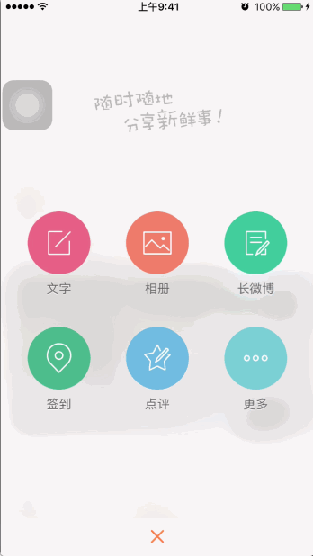

# 撰写按钮点击动画

## 效果




- 点击加号背景磨砂效果
- 各个按钮依次弹出
- 点击空白处按钮依次消失，恢复弹出前的效果
- 某个按钮点击有放大并且透明效果，其他缩小透明效果

## 实现思路

- 磨砂效果可以用苹果提供的图片磨砂分类 `UIImage+ImageEffects.h`
- 按钮弹出的动画可以使用 `Facebook` 开源的 `Pop` 框架
- 放大透明

## 实现代码

- 自定义弹出的整体控件 `HMComposeView`

```swift
class HMComposeView: UIView {

    override init(frame: CGRect) {
        super.init(frame: frame)

        // 由于当前 View 的特殊性，所以自己指定宽高
        self.size = CGSizeMake(SCREENW, SCREENH)
        // 设置背景颜色 (为了能展示出来效果)
        backgroundColor = UIColor(white: 0.95, alpha: 0.5)
    }

    required init?(coder aDecoder: NSCoder) {
        fatalError("init(coder:) has not been implemented")
    }
}
```

- 点击加号按钮的时候展示在屏幕的最上层

```swift
// 在 HMMainViewController 的 viewDidLoad 方法里
let tab = HMTabBar()
//设置撰写按钮点击的事件响应
tab.composeButtonClickBlock = {
    print("撰写按钮点击")

    let composeView = HMComposeView()
    // 获取到屏幕上当前点击的最后一个 window
    let window = UIApplication.sharedApplication().windows.last!
    window.addSubview(composeView)
}
```

- 在触摸 `HMComposeView` 的时候消失

```swift
override func touchesBegan(touches: Set<UITouch>, withEvent event: UIEvent?) {
    removeFromSuperview()
}
```

### 背景磨砂效果

1. 先把屏幕的内容截图
2. 利用 `UIImage+ImageEffects` 分类把图片处理成磨砂效果


- 屏幕截图

```swift
/// 获取屏幕截图
///
/// - returns: 屏幕当前内容
private func getScreenShot() -> UIImage {
    // 获取到主window
    let window = UIApplication.sharedApplication().keyWindow
    // 开启上下文  size： 大小 opaque：是否透明 scale：缩放系数（0：分辨率大小 1：点坐标大小）
    UIGraphicsBeginImageContextWithOptions(window!.size, false, 0)
    // 把主window的内容画上去
    window?.drawViewHierarchyInRect(window!.bounds, afterScreenUpdates: false)
    // 获取到当前上下文的图片
    let image = UIGraphicsGetImageFromCurrentImageContext()
    // 约束上下文
    UIGraphicsEndImageContext()

    return image
}
```

- 拖入分类设置磨砂效果并添加到当前 View 上

```swift
// 磨砂背景
private lazy var bgImageView: UIImageView = {
    let imageView = UIImageView(image: self.getScreenShot().applyLightEffect())
    return imageView
}()

...
private func setupUI(){

    // 添加子控件
    addSubview(bgImageView)

    // 添加约束
    bgImageView.snp_makeConstraints { (make) -> Void in
        make.edges.equalTo(self.snp_edges)
    }
}
```

- 添加 slogan 控件

```swift
// 懒加载控件
private lazy var sloganImage: UIImageView = UIImageView(image: UIImage(named: "compose_slogan"))

// 添加子控件
addSubview(sloganImage)

// 添加约束
sloganImage.snp_makeConstraints { (make) -> Void in
    make.centerX.equalTo(self.snp_centerX)
    make.top.equalTo(self.snp_top).offset(100)
}
```

### 弹性动画

- 自定义菜单按钮（图片在上面，文字在下面）

```swift
class HMComposeMenuButton: UIButton {

    // 重写 highlighted 属性，去掉高亮效果
    override var highlighted: Bool {
        set{}

        get{
            return false
        }
    }

    override init(frame: CGRect) {
        super.init(frame: frame)
        setupUI()
    }

    required init?(coder aDecoder: NSCoder) {
        super.init(coder: aDecoder)
        setupUI()
    }

    private func setupUI(){
        // 文字大小
        titleLabel?.font = UIFont.systemFontOfSize(14)
        // 文字颜色
        setTitleColor(UIColor.grayColor(), forState: UIControlState.Normal)
        // 设置文字居中
        titleLabel?.textAlignment = .Center
        // 设置图片显示模型
        imageView?.contentMode = .Center
    }

    /// 重写 layoutSubviews 调整文字与图片的位置
    override func layoutSubviews() {
        super.layoutSubviews()

        // 设置图片位置
        imageView?.size = CGSizeMake(self.width, self.width)
        imageView?.x = 0
        imageView?.y = 0

        // 设置文字位置
        titleLabel?.x = 0
        titleLabel?.y = self.width
        titleLabel?.size = CGSizeMake(self.width, self.height - self.width)
    }
}
```


- 遍历添加6个按钮

```swift
/// 添加子按钮
private func addChildButton(){

    // 最大列数
    let maxRow: CGFloat = 3

    // 按钮的宽与高
    let childButtonW: CGFloat = 80
    let childButtonH: CGFloat = 110

    // 按钮水平方向间隔
    let margin = (SCREENW - (childButtonW * maxRow)) / (maxRow + 1)

    for i in 0..<6 {

        // 初始化按钮
        let button = HMComposeMenuButton()

        // 设置数据
        button.setTitle("文字", forState: UIControlState.Normal)
        button.setImage(UIImage(named: "tabbar_compose_friend"), forState: UIControlState.Normal)

        // 计算当前 button 在第几行，第几列
        let col = i % Int(maxRow)
        let row = i / Int(maxRow)

        // 设置位置与大小
        button.x = CGFloat(col + 1) * margin + CGFloat(col) * childButtonW
        button.y = CGFloat(row) * (margin + childButtonW)
        button.size = CGSizeMake(childButtonW, childButtonH);

        addSubview(button)
    }
}
```

- 利用 plist 文件设置每一个按钮的显示信息

```swift
/// 添加子按钮
private func addChildButton(){

    ...

    // 每个 button 要显示的数据
    let composetButtonInfos = NSArray(contentsOfFile: NSBundle.mainBundle().pathForResource("compose.plist", ofType: nil)!)!

    for i in 0..<composetButtonInfos.count {

        // 初始化按钮
        let button = HMComposeMenuButton()

        // 读取 title 与 icon 数据
        let title = composetButtonInfos[i]["title"] as! String
        let icon = composetButtonInfos[i]["icon"] as! String

        // 设置数据
        button.setTitle(title, forState: UIControlState.Normal)
        button.setImage(UIImage(named: icon), forState: UIControlState.Normal)
        ...
    }
}
```

> 运行测试

- 仿照其他框架设计思想，提供 `show` 的方法显示出来

```swift
/// 将当前 View 显示出来
func show(){
    // 获取到屏幕上当前点击的最后一个 window
    let window = UIApplication.sharedApplication().windows.last!
    window.addSubview(self)
}

...

// MainViewController 中加号按钮点击事件
let tab = HMTabBar()
//设置撰写按钮点击的事件响应
tab.composeButtonClickBlock = {
    print("撰写按钮点击")

    let composeView = HMComposeView()
    composeView.show()
}
```

- 调整每一个按钮的位置，以便执行动画

```swift
// 设置位置与大小
button.y = CGFloat(row) * (margin + childButtonW) + SCREENH
```

- 添加 `pop` 框架到框架，在 Podfile 中添加以下代码

```
pod 'pop'
```

- 记录添加的每一个子菜单按钮

```swift
/// 菜单按钮的集合
private lazy var menuButtons: [UIButton] = [UIButton]()

/// 添加子按钮的时候一并添加到上面定义的集合里面去
for i in 0..<composetButtonInfos.count {
    ...
    addSubview(button)
    menuButtons.append(button)
}
```

- 在外界执行 `show` 的时候，执行动画

```swift
/// 将当前 View 显示出来
func show(){
    // 获取到屏幕上当前点击的最后一个 window
    let window = UIApplication.sharedApplication().windows.last!
    window.addSubview(self)

    for (index,value) in menuButtons.enumerate() {
        let anim = POPSpringAnimation(propertyNamed: kPOPViewCenter)
        // 执行动画
        anim.toValue = NSValue(CGPoint: CGPointMake(value.centerX, value.centerY - 350))
        // 弹性度
        anim.springBounciness = 8
        // 弹动速度
        anim.springSpeed = 10
        // 开始时间
        anim.beginTime = CACurrentMediaTime() + 0.025 * Double(index)
        // 添加动画
        value.pop_addAnimation(anim, forKey: nil)
    }
}
```
> 运行测试

- 在当前界面要移除的时候执行动画

```swift
override func touchesBegan(touches: Set<UITouch>, withEvent event: UIEvent?) {
    for (index,value) in menuButtons.reverse().enumerate() {

        let anim = POPSpringAnimation(propertyNamed: kPOPViewCenter)
        // 执行动画
        anim.toValue = NSValue(CGPoint: CGPointMake(value.centerX, value.centerY + 350))
        // 弹性度
        anim.springBounciness = 8
        // 弹动速度
        anim.springSpeed = 10
        // 开始时间
        anim.beginTime = CACurrentMediaTime() + 0.025 * Double(index)
        // 添加动画
        value.pop_addAnimation(anim, forKey: nil)
    }

    // 0.3秒之后移除
    dispatch_after(dispatch_time(DISPATCH_TIME_NOW, Int64(0.3 * Double(NSEC_PER_SEC))), dispatch_get_main_queue()) { () -> Void in
        self.removeFromSuperview()
    }
}
```
> 运行测试

- 重复代码抽取
    - 弹出动画与消失的动画代码重复
    - 抽取出一个方法，区分出是往上执行动画还是往下执行动画

- 定义枚举，区分动画执行方向

```swift
/// 动画执行方向
///
/// - UP:   往上执行
/// - DOWN: 往下执行
enum ComposeMenuAnimType: Int {
    case UP = 0
    case DOWN = 1
}
```
- 抽取执行动画的方法

```swift
/// 执行动画逻辑
///
/// - parameter button:    要执行动画的对象
/// - parameter beginTime: 开始执行动画的时间
/// - parameter type:      执行
private func anim(button: UIButton, beginTime: CFTimeInterval, type:ComposeMenuAnimType){

    let anim = POPSpringAnimation(propertyNamed: kPOPViewCenter)
    // 执行动画
    if type == .UP {
        anim.toValue = NSValue(CGPoint: CGPointMake(button.centerX, button.centerY - 350))
    }else{
        anim.toValue = NSValue(CGPoint: CGPointMake(button.centerX, button.centerY + 350))
    }

    // 弹性度
    anim.springBounciness = 8
    // 弹动速度
    anim.springSpeed = 10
    // 开始时间
    anim.beginTime = beginTime
    // 添加动画
    button.pop_addAnimation(anim, forKey: nil)
}
```

- 调用

```swift
/// 将当前 View 显示出来
func show(){
    // 获取到屏幕上当前点击的最后一个 window
    let window = UIApplication.sharedApplication().windows.last!
    window.addSubview(self)

    for (index,value) in menuButtons.enumerate() {
        anim(value, beginTime: CACurrentMediaTime() + 0.025 * Double(index), type: .UP)
    }
}
```

> 运行测试

### 点击动画处理

- 添加按钮点击事件

```swift
// 初始化按钮
let button = HMComposeMenuButton()
button.addTarget(self, action: "composeButtonClick:", forControlEvents: .TouchUpInside)
```

- 实现方法

```swift
@objc private func composeButtonClick(button: UIButton) {
    UIView.animateWithDuration(0.25, animations: { () -> Void in
        for value in self.menuButtons {
            value.alpha = 0.0
            if value == button {
                // 如果是当前点击的button，执行放大
                value.transform = CGAffineTransformMakeScale(2, 2)
            }else{
                // 否则缩小
                value.transform = CGAffineTransformMakeScale(0.3, 0.3)
            }
        }}, completion: { (finish) -> Void in
            for value in self.menuButtons {
                UIView.animateWithDuration(0.25, animations: { () -> Void in
                    value.transform = CGAffineTransformIdentity
                    value.alpha = 1
                })
            }
    })
}
```

- 新建控制器 `HMComposeViewController`

```swift
class HMComposeViewController: UIViewController {

    override func viewDidLoad() {
        super.viewDidLoad()

        setupUI()
    }

    private func setupUI(){
        view.backgroundColor = UIColor.whiteColor()
        navigationItem.leftBarButtonItem = UIBarButtonItem.item(title: "返回", target: self, action: "back")
    }

    @objc private func back(){
        dismissViewControllerAnimated(true, completion: nil)
    }
}
```


- 在点击按钮的时候弹出
    - 发现问题，要弹出控制器需要用到另一个控制器，所以将 `HMMainViewController` 控制器传入

```swift
// 定义属性
var target: UIViewController?

// 更改 show 方法
func show(target: UIViewController){
    self.target = target
    ...
}

...

// 外界通过 show 这个方法传入
let composeView = HMComposeView()
composeView.show(self)
```

- 点击弹出控制器

```swift
@objc private func composeButtonClick(button: UIButton) {
    UIView.animateWithDuration(0.25, animations: { () -> Void in
        ...
        }}, completion: { (finish) -> Void in
            let controller = HMNavigationController(rootViewController: HMComposeViewController())
            self.target?.presentViewController(controller, animated: true, completion: { () -> Void in
                self.removeFromSuperview()
            })
    })
}
```

> 运行测试：发现并没有看到从下往上弹出的效果，原因控制器是在 `composeView` 的下面弹出的，所以分析之后，需要把 `composeView` 添加到 `HMMainViewController` 的 view 上

- 更改添加的代码

```swift
/// 将当前 View 显示出来
func show(target: UIViewController){
    self.target = target

    // 添加到传入的控制器身上
    target.view.addSubview(self)

    for (index,value) in menuButtons.enumerate() {
        anim(value, beginTime: CACurrentMediaTime() + 0.025 * Double(index), type: .UP)
    }
}
```
