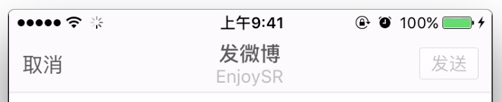

# 界面搭建


## 导航栏内容

- 显示效果



- 标题视图懒加载

```swift
// MARK: - 懒加载

/// 顶部标题视图
private lazy var titleView: UILabel = {
    let label = UILabel()
    // 设置多行
    label.numberOfLines = 0
    // 字体大小
    label.font = UIFont.systemFontOfSize(14)
    // 文字居中
    label.textAlignment = NSTextAlignment.Center
    // 如果有用户昵称
    if let name = HMUserAccountViewModel.sharedInstance.userAccount?.name {
        // 初始化一个带有属性的文字
        var attr = NSMutableAttributedString(string: "发微博\n\(name)")
        // 获取到要添加的属性的范围
        let range = (attr.string as NSString).rangeOfString(name)
        // 添加属性
        attr.addAttribute(NSFontAttributeName, value: UIFont.systemFontOfSize(12), range: range)
        attr.addAttribute(NSForegroundColorAttributeName, value: UIColor.lightGrayColor() ,range: range)
        label.attributedText = attr
    }else{
        label.text = "发微博"
    }
    label.sizeToFit()
    return label
}()
```

- 右边按钮懒加载

```swift
/// 右边按钮
private lazy var rightButton: UIButton = {
    let button = UIButton()

    // 添加点击事件
    button.addTarget(self, action: "send", forControlEvents: UIControlEvents.TouchUpInside)

    // 设置文字属性
    button.titleLabel?.font = UIFont.systemFontOfSize(13)
    button.setTitle("发送", forState: UIControlState.Normal)

    // 设置不同状态的文字
    button.setTitleColor(UIColor.grayColor(), forState: UIControlState.Disabled)
    button.setTitleColor(UIColor.whiteColor(), forState: UIControlState.Normal)

    // 设置不同状态的背景图片
    button.setBackgroundImage(UIImage(named: "common_button_white_disable"), forState: UIControlState.Disabled)
    button.setBackgroundImage(UIImage(named: "common_button_orange"), forState: UIControlState.Normal)
    button.setBackgroundImage(UIImage(named: "common_button_orange_highlighted"), forState: UIControlState.Highlighted)

    // 设置宽高
    button.height = 30
    button.width = 44

    return button
}()
```

- 实现 `send` 方法

```swift
@objc private func send(){
    printLog("发送")
}
```

- 设置导航栏内容

```swift
// 设置导航栏内容
private func setupNav(){
    // 设置左边 Item
    navigationItem.leftBarButtonItem = UIBarButtonItem.item(title: "返回", target: self, action: "back")
    // 设置中间 titleView
    navigationItem.titleView = titleView
    // 设置右边 Item
    navigationItem.rightBarButtonItem = UIBarButtonItem(customView: rightButton)
    // 默认为不可用状态
    navigationItem.rightBarButtonItem?.enabled = false
}
```

> 运行测试

## 文字输入框

1. 带有占位文字
2. 可以像 UITextView 一样输入多行
3. 自定义一个输入框继承于 UITextView，向里面添加一个 label


- 代码实现

```swift
class HMTextView: UITextView {

    /// 重写的是指定构造函数
    override init(frame: CGRect, textContainer: NSTextContainer?) {
        super.init(frame: frame, textContainer: textContainer)

        // 添加占位控件
        addSubview(placeholderLabel)

        // 添加约束
        placeholderLabel.snp_makeConstraints { (make) -> Void in
            make.width.lessThanOrEqualTo(self.snp_width).offset(-10)
            make.leading.equalTo(self.snp_leading).offset(5)
            make.top.equalTo(self.snp_top).offset(8)
        }
    }

    required init?(coder aDecoder: NSCoder) {
        fatalError("init(coder:) has not been implemented")
    }

    // 占位文字控件
    private lazy var placeholderLabel: UILabel = {
        let label = UILabel()
        // 设置文字颜色以及大小
        label.font = UIFont.systemFontOfSize(12)
        label.textColor = UIColor.lightGrayColor()
        label.text = "请输入文字"

        // 多行
        label.numberOfLines = 0
        return label
    }()
}
```

- 添加到 controller 中使用

```swift
// 懒加载控件
private lazy var textView: HMTextView = {
    let textView = HMTextView()
    return textView
}()

// setupUI 方法中添加子控件并设置约束

view.addSubview(textView)
textView.snp_makeConstraints { (make) -> Void in
    make.edges.equalTo(self.view.snp_edges)
}

```
> 运行测试

- 在 `HMTextView` 中提供给外界设置占位文字的属性

```swift
// 添加 placeholder 属性，代外界设置值
var placeholder: String? {
    didSet{
        placeholderLabel.text = placeholder
    }
}
```

- 重写 `font` 属性，以让占位文字与输入的文字字体大小一样

```swift
override var font: UIFont? {
    didSet{
        placeholderLabel.font = font
    }
}
```

- 外界设置文字大小

```swift
textView.font = UIFont.systemFontOfSize(16)
```

> 运行测试：占位文字与输入的文字一样大

- 监听文字改变的时候，去执行占位控件的隐藏与显示逻辑

```swift
// 监听文字改变的通知
NSNotificationCenter.defaultCenter().addObserver(self, selector: "textDidChange", name: UITextViewTextDidChangeNotification, object: self)
```

- 文字改变之后调用的方法

```swift
/// 文字改变的时候会调用这个方法，当前如果有文字的话就隐藏占位 label
@objc private func textDidChange(){
    placeholderLabel.hidden = hasText()
}
```

> 运行测试。注：监听文字改变在这个地方不要使用代理，因为自己一般不成为自己的代理。

## 底部 ToolBar 初始化

- 实现方式：UIStackView
    - 可以自动帮我们排列子控件，免去烦索的约束
    - 其本身是一个非渲染类型的 View，其只作为一个容器，到底显示什么由内部子控件决定


- 自定义 `HMComposeToolBar` 继承于 `UIStackView`

```swift
class HMComposeToolBar: UIStackView {

    override init(frame: CGRect) {
        super.init(frame: frame)
        // 设置布局方向 水平
        axis = UILayoutConstraintAxis.Horizontal
        // 设置子控件的分布方式 宽度相等并且填充
        distribution = UIStackViewDistribution.FillEqually
        // 设置背景颜色
        backgroundColor = UIColor(patternImage: UIImage(named: "compose_toolbar_background")!)
    }

    required init?(coder aDecoder: NSCoder) {
        fatalError("init(coder:) has not been implemented")
    }
}
```

- 在 `HMComposeViewController` 中懒加载控件

```swift
/// composeToolBar
private lazy var composeToolBar: HMComposeToolBar = HMComposeToolBar(frame: CGRectZero)
```


- 在 `HMComposeViewController` 的 `setupUI` 方法中添加控件与约束

```swift
view.addSubview(composeToolBar)

// 添加约束
composeToolBar.snp_makeConstraints { (make) -> Void in
    make.bottom.equalTo(self.view.snp_bottom)
    make.width.equalTo(self.view.snp_width)
    make.height.equalTo(44)
}
```

> 运行测试：并不能看到控件，背景颜色设置失败，原因：UIStackView 是 UIView 的非渲染型子类(通俗的说，他光靠自己是不能显示东西的)，所以设置背景颜色失效


- 在 `HMComposeToolBar` 添加向当前 view 添加子控件的方法 `addChildItem`

```swift
/// 添加子控件
private func addChildItem(imageName: String) {

    let button = UIButton()
    // 设置不同状态的图片
    button.setImage(UIImage(named: imageName), forState: UIControlState.Normal)
    button.setImage(UIImage(named: "\(imageName)_highlighted"), forState: UIControlState.Highlighted)
    // 设置背景颜色
    button.backgroundColor = UIColor(patternImage: UIImage(named: "compose_toolbar_background")!)
    // 添加到当前 view 中去
    addArrangedSubview(button)
}
```
> 注：此处添加子控件的方法是 `addArrangedSubview` ，在 UIStackView 中使用 `addSubview` 方法无效

- 添加 5 个按钮 -> 在 `initWithFrame` 调用 `setupUI` 方法

```swift
private func setupUI(){
    addChildItem("compose_toolbar_picture")
    addChildItem("compose_mentionbutton_background")
    addChildItem("compose_trendbutton_background")
    addChildItem("compose_emoticonbutton_background")
    addChildItem("compose_add_background")
}
```
> 运行测试

## 底部 ToolBar 跟随键盘移动

- 监听键盘 frame 改变通知

```swift
// 监听键盘 frame 改变通知
NSNotificationCenter.defaultCenter().addObserver(self, selector: "keyboardWillChangeFrame:", name: UIKeyboardWillChangeFrameNotification, object: nil)
```

- 注销通知

```swift
deinit{
    NSNotificationCenter.defaultCenter().removeObserver(self)
}
```
- 在键盘 frame 改变做更新约束的逻辑

```swift
/// 键盘 frame 改变通知调用的方法
@objc private func keyboardWillChangeFrame(noti: NSNotification){

    let endFrame = (noti.userInfo![UIKeyboardFrameEndUserInfoKey] as! NSValue).CGRectValue()

    // 更新约束
    composeToolBar.snp_updateConstraints { (make) -> Void in
        make.bottom.equalTo(self.view.snp_bottom).offset(endFrame.origin.y - self.view.height)
    }

    UIView.animateWithDuration(0.25) { () -> Void in
        self.composeToolBar.layoutIfNeeded()
    }
}
```

- 拖动 textView 的时候退下键盘：打开 textView 垂直方向弹簧效果，并设置代理

```swift
textView.alwaysBounceVertical = true
textView.delegate = self
```

- 实现协议，并实现协议方法

```swift
func scrollViewDidScroll(scrollView: UIScrollView) {
    self.view.endEditing(true)
}
```

- 实现 `textViewDidChange` 的方法，当textView有文字输入的时候右边按钮可用

```swift
func textViewDidChange(textView: UITextView) {
    self.navigationItem.rightBarButtonItem?.enabled = textView.hasText()
}
```


> 运行测试

### 底部 ToolBar 点击事件回调

1. 当我们点击 ToolBar 中的某一个按钮的时候，需要回调到控制器中去，可以使用`代理`实现
2. 需要区分是哪一个按钮点击了，可以使用 `枚举+按钮` 来区分


- 定义枚举

```swift
/// 区分各个按钮的枚举
enum ComposeToolBarButtonType: Int {
    case Picture = 0    // 图片
    case Mention = 1    // @
    case Trend = 2      // 话题
    case Emoticon = 3   // 表情
    case Add = 4        // 加号
}
```

- 给 `addChildItem` 方法添加传入当前按钮是什么类型的参数

```swift
/// 添加子控件
///
/// - parameter imageName: 图片名字
/// - parameter type:      当前按钮的类型
///
private func addChildItem(imageName: String, type: ComposeToolBarButtonType) {

    let button = UIButton()
    // 设置枚举值
    button.tag = type.rawValue
    ...
    // 添加到当前 view 中去
    addArrangedSubview(button)
    return button
}
```

- 在添加按钮的时候传入按钮类型

```swift
private func setupUI(){
    addChildItem("compose_toolbar_picture", type: .Picture)
    addChildItem("compose_mentionbutton_background", type: .Mention)
    addChildItem("compose_trendbutton_background", type: .Trend)
    addChildItem("compose_emoticonbutton_background", type: .Emoticon)
    addChildItem("compose_add_background", type: .Add)
}
```

- 新增协议

```swift
/// 按钮点击协议
protocol HMComposeToolBarDelegate: NSObjectProtocol {
    func composeToolBarButtonDidSelected(type: ComposeToolBarButtonType)
}
```

- 定义代理属性

```swift
// 定义代理属性
weak var delegate: HMComposeToolBarDelegate?
```


- 在 `addChildItem` 方法中，给初始化的按钮添加点击事件

```swift
button.addTarget(self, action: "childButtonClick:", forControlEvents: UIControlEvents.TouchUpInside)
```
- 点击事件的方法实现

```swift
@objc private func childButtonClick(button: UIButton){
    if let delegate = self.delegate {
        delegate.composeToolBarButtonDidSelected(ComposeToolBarButtonType(rawValue: button.tag)!)
    }
}
```

- 在 `HMComposeViewController` 中设置 toolBar 的代理，继承协议

```swift
/// composeToolBar
private lazy var composeToolBar: HMComposeToolBar = {
    let toolBar = HMComposeToolBar(frame: CGRectZero)
    toolBar.delegate = self
    return toolBar
}()
```
- 实现协议方法

```swift
// MARK: - HMComposeToolBarDelegate
func composeToolBarButtonDidSelected(type: ComposeToolBarButtonType) {
    switch type {
    case .Picture:
        printLog("图片")
    case .Mention:
        printLog("@")
    case .Trend:
        printLog("话题")
    case .Emoticon:
        printLog("表情")
    case .Add:
        printLog("加号")
    }
}
```
> 运行测试


