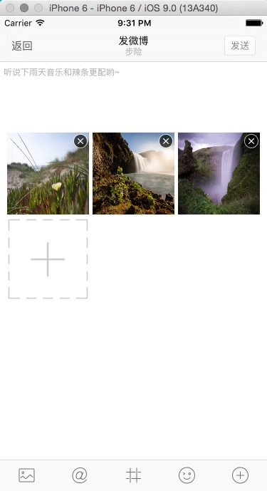
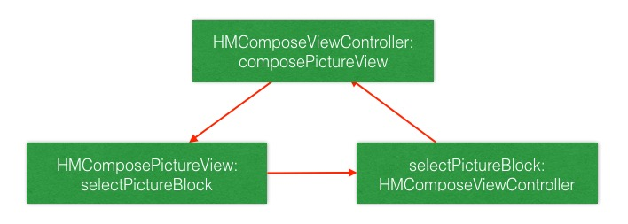

# 选择图片

1. 点击 toolBar 图片按钮，调起系统选择图片控制器选择图片
2. 图片选择完毕之后展示在界面上


## UIImagePickerController

- 3 种数据类型
```
public enum UIImagePickerControllerSourceType : Int {

    case PhotoLibrary       // 图库，包含相册
    case Camera             // 照相机
    case SavedPhotosAlbum   // 相册
}
```

- 判断照相机是否可用

```swift
/// 参数 .Front: 前置摄像头 Rear: 后置摄像头
UIImagePickerController.isCameraDeviceAvailable(.Front)
```

- 判断数据类型是否可用

```swift
UIImagePickerController.isSourceTypeAvailable(.PhotoLibrary)
```

## 选择图片

- 添加 `selectedPicture` 方法

```swift
/// 选择照片
private func selectPicture(){
    // 先判断图库是否可以使用
    if UIImagePickerController.isSourceTypeAvailable(.PhotoLibrary) {
        // 初始化控制器并设置代理
        let imagePickerController = UIImagePickerController()
        // 弹出该控制器
        presentViewController(imagePickerController, animated: true, completion: nil)
    }
}
```

- 在 toolBar 代理方法中调用 `selectedPicture` 方法

```swift
case .Picture:
    selectPicture()
```

> 运行测试：要想获取到用户选择的照片，需要设置 `UIImagePickerController` 的代理

- 设置代理，继承协议

```
// 调协代理
imagePickerController.delegate = self
```

- 实现协议方法

```swift
// 图片选择完毕
func imagePickerController(picker: UIImagePickerController, didFinishPickingImage image: UIImage, editingInfo: [String : AnyObject]?) {
    printLog(image)
}
```
> 运行测试：有打印 image 的数据，但是选择图片的控制器并不会消失，原因是只要实现了选择完图片的协议方法，控制器不会自己销毁，需要自己使用代码销毁

- 更改协议方法逻辑

```swift
// 图片选择完毕
func imagePickerController(picker: UIImagePickerController, didFinishPickingImage image: UIImage, editingInfo: [String : AnyObject]?) {
    printLog(image)
    picker.dismissViewControllerAnimated(true, completion: nil)
}
```

## 显示图片

- 选择完图片，需要把图片显示到控制器上，效果如下：



分析出可以使用 `UICollectionView` 实现。

### 界面展示

> 思考：自定此 View 需要向外界提供哪些方法

- 新建类 `HMComposePictureView` 继承于 `UICollectionView`

```swift
class HMComposePictureView: UICollectionView {

    override init(frame: CGRect, collectionViewLayout layout: UICollectionViewLayout) {
        super.init(frame: frame, collectionViewLayout: UICollectionViewFlowLayout())

        // 设置随机背景色测试
        backgroundColor = RandomColor()
    }

    required init?(coder aDecoder: NSCoder) {
        fatalError("init(coder:) has not been implemented")
    }
}
```

- 添加到控制器中

```swift
// 懒加载控件
/// 配图控件
private lazy var composePictureView: HMComposePictureView = HMComposePictureView()

...

// 添加控件并设置约束
// 因为配图视图可以跟随 textView 滚动，所以添加到 textView上
textView.addSubview(composePictureView)

composePictureView.snp_makeConstraints { (make) -> Void in
    make.top.equalTo(textView.snp_top).offset(100)
    make.centerX.equalTo(textView.snp_centerX)
    make.width.equalTo(textView.snp_width).offset(-20)
    make.height.equalTo(composePictureView.snp_width)
}
```

> 运行测试

- 在 `HMComposePictureView` 设置数据源为自己并注册系统的cell

```swift
// 注册cell
registerClass(UICollectionViewCell.self, forCellWithReuseIdentifier: HMComposePictureViewCellId)
// 设置数据源以及代理
dataSource = self
delegate = self
```

- 定义可重用标识符

```swift
/// 可重用标识符
private let HMComposePictureViewCellId = "HMComposePictureViewCellId"
```

- 实现两个数据源方法

```swift
extension HMComposePictureView {

    func collectionView(collectionView: UICollectionView, numberOfItemsInSection section: Int) -> Int {
        return 9
    }

    func collectionView(collectionView: UICollectionView, cellForItemAtIndexPath indexPath: NSIndexPath) -> UICollectionViewCell {
        let cell =  collectionView.dequeueReusableCellWithReuseIdentifier(HMComposePictureViewCellId, forIndexPath: indexPath)
        cell.backgroundColor = RandomColor()
        return cell
    }
}
```
> 运行测试：遇到问题

1. 发现每一个 item 的大小并不是我们想要的，所以需要调整 item 的大小。
2. 而 item 的大小是由 `HMComposePictureView` 的大小来决定的
3. 所以需要知道 `HMComposePictureView` 的大小的情况下去设置条目的大小
4. 在 `layoutSubViews` 方法里面就可以获取到当前控件的大小


- 定义相关常量

```swift
/// 每一个子条目之间的间距
private let HMComposePictureViewItemMargin: CGFloat = 5
/// 在当前 View 中最多显示几列子条目
private let HMComposePictureViewItemMaxCol = 3
```


- 在 `layoutSubViews`设置 item 的大小

```swift
override func layoutSubviews() {
    super.layoutSubviews()

    // 获取到当前的布局对象
    let layout = self.collectionViewLayout as! UICollectionViewFlowLayout

    //假设最大列数为3，那么： 条目宽高 ＝ (当前控件宽度 - 2个间距) / 3 列
    let itemWH = (self.width - (CGFloat(HMComposePictureViewItemMaxCol - 1) * HMComposePictureViewItemMargin)) / CGFloat(HMComposePictureViewItemMaxCol)

    // 设置条目大小
    layout.itemSize = CGSizeMake(itemWH, itemWH)
    // 设置间距
    layout.minimumInteritemSpacing = HMComposePictureViewItemMargin
    layout.minimumLineSpacing = HMComposePictureViewItemMargin
}

```
> 运行测试

### 设置数据

- 提供 `addImage` 方法供外界调用，并定义一个集合保存当前添加的image

```swift
// 懒加载一个集合，保存当前配图视图里面的图片集合
/// 当前控件展示的图片集合
private lazy var images: [UIImage] = [UIImage]()

...

/// 添加图片
func addImage(image: UIImage){
    images.append(image)
}
```

- 更改数据源方法，返回图片张数

```swift
func collectionView(collectionView: UICollectionView, numberOfItemsInSection section: Int) -> Int {
    return images.count
}
```

- `HMComposeViewController` 选择完图片之后调用 `addImage` 的方法

```swift
// 图片选择完毕
func imagePickerController(picker: UIImagePickerController, didFinishPickingImage image: UIImage, editingInfo: [String : AnyObject]?) {
    // 添加到配图视图中去
    composePictureView.addImage(image)
    // 销毁掉选择图片的控制器
    picker.dismissViewControllerAnimated(true, completion: nil)
}
```
> 运行测试

- 自定义 `HMComposePictureCell` 以显示图片

```swift
private class HMComposePictureCell: UICollectionViewCell {

    // 当前 cell 显示的图片
    var image: UIImage? {
        didSet{
            imageView.image = image
        }
    }

    override init(frame: CGRect) {
        super.init(frame: frame)

        // 添加控件
        contentView.addSubview(imageView)

        // 设置约束
        imageView.snp_makeConstraints { (make) -> Void in
            make.edges.equalTo(contentView.snp_edges)
        }
    }

    required init?(coder aDecoder: NSCoder) {
        fatalError("init(coder:) has not been implemented")
    }

    // MARK: - 懒加载控件
    // 显示图片的控件
    private lazy var imageView: UIImageView = UIImageView()
}
```

- 更改注册的 cell

```swift
    override init(frame: CGRect, collectionViewLayout layout: UICollectionViewLayout) {
        super.init(frame: frame, collectionViewLayout: UICollectionViewFlowLayout())

        // 设置随机背景色测试
        backgroundColor = RandomColor()
        // 注册cell
        registerClass(HMComposePictureCell.self, forCellWithReuseIdentifier: HMComposePictureViewCellId)
        // 设置数据源
        dataSource = self
    }
```

- 更新返回 cell 的方法

```swift
func collectionView(collectionView: UICollectionView, cellForItemAtIndexPath indexPath: NSIndexPath) -> UICollectionViewCell {
    let cell =  collectionView.dequeueReusableCellWithReuseIdentifier(HMComposePictureViewCellId, forIndexPath: indexPath) as! HMComposePictureCell
    // 设置图片
    cell.image = images[indexPath.row]
    return cell
}
```

> 运行测试

- 添加删除按钮

```
/// 删除按钮控件
private lazy var deleteButton: UIButton = {
    let button = UIButton()
    button.setImage(UIImage(named: "compose_photo_close"), forState: UIControlState.Normal)
    return button
}()

// 添加子控件
contentView.addSubview(deleteButton)

// 设置约束
deleteButton.snp_makeConstraints { (make) -> Void in
    make.top.equalTo(contentView.snp_top)
    make.trailing.equalTo(contentView.snp_trailing)
}
```

- 监听删除按钮点击

```swift
/// 在删除按钮控件懒加载闭包里面添加
button.addTarget(self, action: "deleteButtonClick", forControlEvents: UIControlEvents.TouchUpInside)
```

- 添加协议，cell 里面删除按钮点击需要回调到 `HMComposePictureView`

```swift
private protocol HMComposePictureCellDelegate: NSObjectProtocol{
    func composePictureCellDidRemove(indexPath: NSIndexPath)
}
```

- 添加代理属性。并在删除按钮点击的时候调用协议方法

```swift
@objc private func deleteButtonClick(){
        self.delegate?.composePictureCellDidRemove(self.indexPath!)
}
```

- `HMComposePictureView` 遵循协议，成为 cell 的代理

```swift
class HMComposePictureView: UICollectionView, UICollectionViewDataSource, UICollectionViewDelegate, HMComposePictureCellDelegate {
...
}
```


```swift
func collectionView(collectionView: UICollectionView, cellForItemAtIndexPath indexPath: NSIndexPath) -> UICollectionViewCell {
    let cell =  collectionView.dequeueReusableCellWithReuseIdentifier(HMComposePictureViewCellId, forIndexPath: indexPath) as! HMComposePictureCell
    cell.image = images[indexPath.row]
    cell.indexPath = indexPath
    cell.delegate = self
    return cell
}

```

- 实现代理方法

```swift
// MARK: - HMComposePictureCellDelegate
private func composePictureCellDidRemove(indexPath: NSIndexPath) {
    self.images.removeAtIndex(indexPath.row)
    reloadData()
}
```

> 运行测试

## 加号按钮

- 更改数据源返回的数量

```swift
func collectionView(collectionView: UICollectionView, numberOfItemsInSection section: Int) -> Int {
    let count = images.count;
    // 如果当前数量为0或者数量为0，则不显示 加号按钮
    return count == 0 || count == 9 ? count : count + 1
}
```

- 设置内容

```swift
func collectionView(collectionView: UICollectionView, cellForItemAtIndexPath indexPath: NSIndexPath) -> UICollectionViewCell {
    let cell =  collectionView.dequeueReusableCellWithReuseIdentifier(HMComposePictureViewCellId, forIndexPath: indexPath) as! HMComposePictureCell
    // 如果当前的 row + 1 超出 images 的范围，则不取图片
    cell.image = indexPath.row + 1 > images.count ? nil : images[indexPath.row]
    cell.indexPath = indexPath
    cell.delegate = self
    return cell
}
```

- 在 cell 的 image 属性的 didSet 里面调整

```swift
// 当前 cell 显示的图片
var image: UIImage? {
    didSet{
        if image != nil {
            imageView.image = image
            // highlightedImage 当 imageView 被选中的时候显示的图片
            imageView.highlightedImage = nil

            // 显示删除按钮
            deleteButton.hidden = false
        }else {
            imageView.image = UIImage(named: "compose_pic_add")
            imageView.highlightedImage = UIImage(named: "compose_pic_add_highlighted")

            // 隐藏删除按钮
            deleteButton.hidden = true
        }
    }
}
```
> 运行测试

## 加号按钮点击添加图片

- 实现协议方法，监听 cell 点击

```swift
func collectionView(collectionView: UICollectionView, didSelectItemAtIndexPath indexPath: NSIndexPath) {
    // 取消选中
    collectionView.deselectItemAtIndexPath(indexPath, animated: false)
    // 当前点击的加号按钮
    if indexPath.row == images.count {
        // 添加图片
        printLog("添加图片")
    }
}
```

- 在 `HMComposePictureView` 中定义点击加号 cell 点击 闭包

```swift
// 当前 View 内容添加图片所需要的闭包
var selectPictureBlock: (()->())?
```
- 在点击添加 cell 的时候执行闭包

```swift
func collectionView(collectionView: UICollectionView, didSelectItemAtIndexPath indexPath: NSIndexPath) {
    // 取消选中
    collectionView.deselectItemAtIndexPath(indexPath, animated: false)
    if indexPath.row == images.count {
        // 添加图片
        printLog("添加图片")
        if let block = selectPictureBlock {
            block()
        }
    }
}
```

- `HMComposeViewController` 中初始化 `HMComposePictureView` 的时候设置闭包

```swift
/// 配图控件
private lazy var composePictureView: HMComposePictureView = {
    let pictureView = HMComposePictureView()
    // 防止循环引用，使用 [weak self]
    pictureView.selectPictureBlock = { [weak self] ()->() in
        self?.selectPicture()
    }
    return pictureView
}()
```
> 运行测试：注意循环引用。`HMComposeViewController` 强制引用 `HMComposePictureView`，而 `HMComposePictureView` 又强制引用 `selectPictureBlock`，再 `selectPictureBlock` 又强制引用 `HMComposeViewController`，所以形成循环引用




- 提供获取所有 image 的方法

```swift
/// 所有图片
func allImages() -> [UIImage] {
    return images
}
```

## 图片大小处理

在添加多张图片的时候，内存暴涨，原因就是图片太大，而在实际开发中客户端使用的图片可以不用这么大，所以提供一个按尺寸缩放的图片的方法

- 新建文件 `UIImage+Extension`，添加 `scale` 方法

```swift
extension UIImage {

    func scaleToWidth(width: CGFloat) -> UIImage {

        // 如果当前 image 的宽度小于等于传入宽度，不缩放
        if self.size.width <= width {
            return self
        }
        // 通过宽度计算出缩放之后的高度
        let height = width / self.size.width  * self.size.height

        // 核心绘图
        // 1.开启上下文
        UIGraphicsBeginImageContext(CGSizeMake(width, height))
        // 2.在指定区域拉伸绘制
        drawInRect(CGRectMake(0, 0, width, height))
        // 3.取到图片
        let image = UIGraphicsGetImageFromCurrentImageContext()
        // 4.关闭上下文
        UIGraphicsEndImageContext()

        // 返回图片
        return image
    }
}
```

- 在 `HMComposeViewController` 中的 `didFinishPickingImage` 方法中更改代码
```swift
// 图片选择完毕
func imagePickerController(picker: UIImagePickerController, didFinishPickingImage image: UIImage, editingInfo: [String : AnyObject]?) {
    // 添加到配图视图中去
    composePictureView.addImage(image.scaleToWidth(300))
    // 销毁掉选择图片的控制器
    picker.dismissViewControllerAnimated(true, completion: nil)
}
```
> 运行测试

## 其他

- 设置 `HMComposePictureView` 的背景色与 `textView` 一样

```swift
/// 配图控件
private lazy var composePictureView: HMComposePictureView = {
    let pictureView = HMComposePictureView()
    pictureView.backgroundColor = self.textView.backgroundColor
    // 防止循环引用，使用 [weak self]
    pictureView.selectPictureBlock = { [weak self] ()->() in
        self?.selectPicture()
    }
    return pictureView
}()
```


