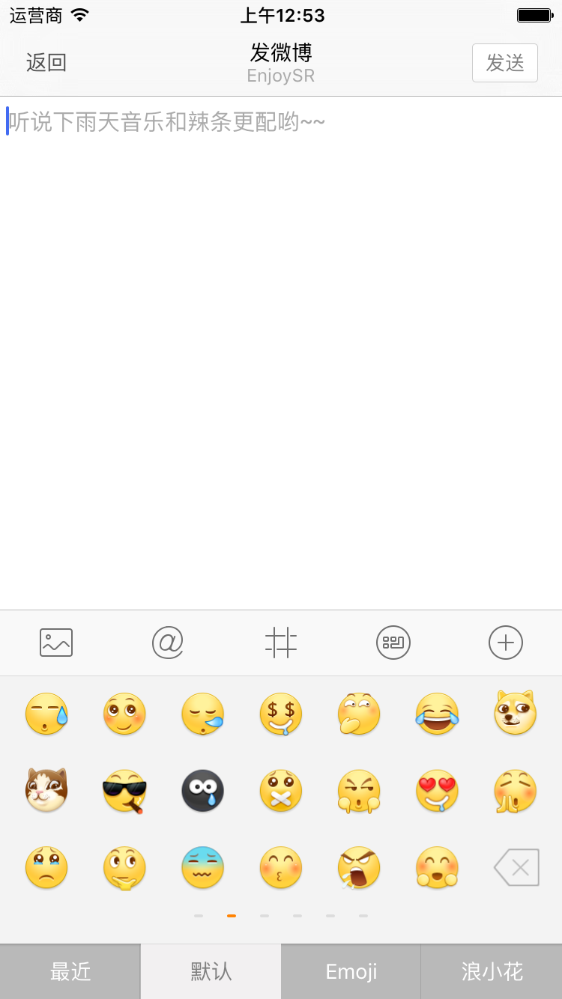
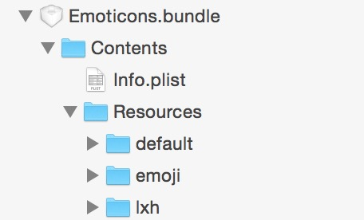
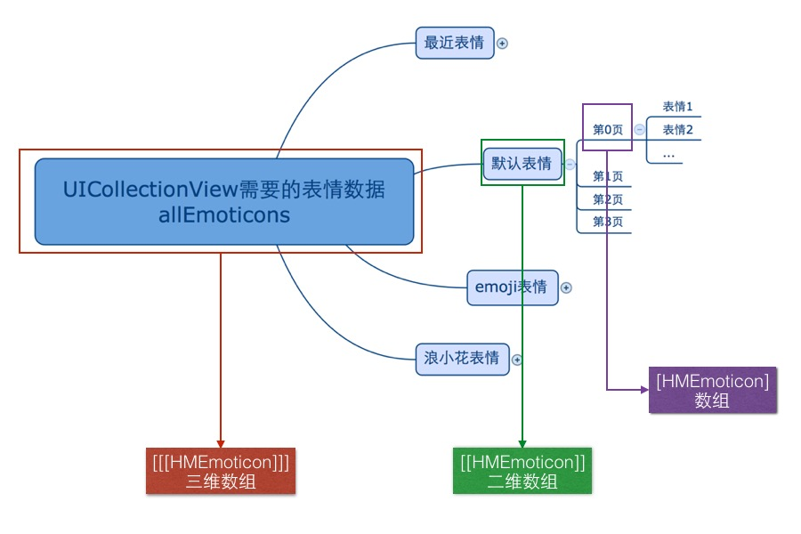

# 表情键盘

在 `Compose` 文件夹下的 `View` 文件夹下新建文件夹 `EmoticonKeyboard`，表情键盘所涉及到的View都放在这个文件夹下

## 实现效果




## 实现思路

1. 从最简单的 View 开始做起
2. 底部切换表情类型的 View 可以使用 `UIStackView` 来实现
3. 表情显示的 View 可以使用 `UICollectionView` 实现
4. 每一页表情对应一个 `Cell` 来表示
5. 每一种表情对应 `UICollectionView` 中的一组


## 自定义 `HMEmoticonKeyboard`

- 自定义 `HMEmoticonKeyboard` 继承于 `UIView`

```swift
class HMEmoticonKeyboard: UIView {

    override init(frame: CGRect) {
        super.init(frame: frame)

        setupUI()
    }

    private func setupUI(){
        // 设置背景颜色
        backgroundColor = UIColor(patternImage: UIImage(named: "emoticon_keyboard_background")!)
    }

    required init?(coder aDecoder: NSCoder) {
        fatalError("init(coder:) has not been implemented")
    }
}
```

- 在 `HMComposeViewController` 中添加切换键盘的方法 `switchKeyboard`

```swift
/// 切换键盘
private func switchKeyboard(){
}
```

- 在点击 `HMComposeToolBar` 上的表情按钮的时候调用方法

```swift
// MARK: - HMComposeToolBarDelegate
func composeToolBarButtonDidSelected(type: ComposeToolBarButtonType) {
    switch type {
    case ...
    case .Emoticon:
        switchKeyboard()
    }
}
```

- 懒加载键盘

```swift
/// 键盘
private lazy var emoticonKeyboard: HMEmoticonKeyboard = {
    let keyboard = HMEmoticonKeyboard()
    keyboard.size = CGSizeMake(SCREENW, 216)
    return keyboard
}()
```


- 切换键盘
    - 要用自己的 View 当成键盘可以设置 UITextView 的 `inputView`属性
    - 如果 `inputView` 为 `nil` 代表当前是系统键盘
    - 切换键盘之后需要重新成为第一响应者，键盘才能看到实时效果

```swift
/// 切换键盘
private func switchKeyboard(){
    // 先取消第一响应者
    textView.resignFirstResponder()
    // 切换键盘，如果是系统键盘就切换成表情键盘，否则就切换成系统键盘
    textView.inputView = textView.inputView == nil ? emoticonKeyboard : nil
    // 成为第一响应者，显示新切换出来的键盘
    textView.becomeFirstResponder()
}
```
> 运行测试：在点击键盘切换的时候 toolBar 会跳动，原因是点击切换键盘会先取消第一响应者，这个时候键盘要退下，toolBar 跟着往下移动。当键盘切换完了之后又变成第一响应者，这个时候 toolBar 还没有往下移动完毕，又需跟着键盘要往上移动，所以形成了这样的效果，解决方式：切换键盘在取消第一响应者的时候不执行动画

- 定义属性 `isToolBarAnim`，默认为 true

```swift
/// 底部 toolBar 是否执行动画
private var isToolBarAnim = true
```

- 在键盘弹出的通过调用的方法判断是否执行

```swift
/// 键盘 frame 改变通知调用的方法
@objc private func keyboardWillChangeFrame(noti: NSNotification){

    // 如果不执行动画，直接返回
    if !isToolBarAnim {
        return
    }
   ...
}
```

- 在切换键盘的时候，改变状态

```swift
/// 切换键盘
private func switchKeyboard(){
    // 取消第一响应者不执行动画 ，置为 false
    isToolBarAnim = false
    // 先取消第一响应者
    textView.resignFirstResponder()

    // 切换键盘，如果是系统键盘就切换成表情键盘，否则就切换成系统键盘
    textView.inputView = textView.inputView == nil ? emoticonKeyboard : nil

    // 切换 toolBar 图标状态
    composeToolBar.isEmoticonKeyboard = textView.inputView != nil
    // 再次成为第一响应者执行动画 ，置为 true
    isToolBarAnim = true
    // 成为第一响应者，显示新切换出来的键盘
    textView.becomeFirstResponder()
}
```

- 切换 toolBar 上键盘图标
    - 如果当前切换到系统键盘显示表情键盘图标
    - 如果当前切换到表情键盘显示系统键盘图标

- 在 `HMComposeToolBar` 中提供 `isEmoticonKeyboard`

```swift
/// 是否是显示的表情键盘
var isEmoticonKeyboard: Bool = false {
    didSet{
        if isEmoticonKeyboard {
            // 显示系统键盘的图标
        }else{
            // 显示表情键盘的图标
        }
    }
}
```

- 在 `HMComposeToolBar` 添加子控件的时候记录表情切换按钮
    - 给 `addChildItem` 方法添加返回值
    - 记录添加表情切换按钮

- 添加返回值

```swift
/// 添加子控件
///
/// - parameter imageName: 图片名字
/// - parameter type:      当前按钮的类型
private func addChildItem(imageName: String, type: ComposeToolBarButtonType) -> UIButton {
    ...
    return button
}
```

- 记录添加的表情键盘切换按钮

```swift
/// 表情键盘切换按钮
private var emoticonButton: UIButton?

...

// 在添加的时候记录
emoticonButton = addChildItem("compose_emoticonbutton_background", type: .Emoticon)

```

- 完善 `isEmoticonKeyboard` 的 `didSet` 方法

```swift
/// 是否是显示的表情键盘
var isEmoticonKeyboard: Bool = false {
    didSet{
        // 默认是表情按钮图标
        var imageName = "compose_emoticonbutton_background"
        if isEmoticonKeyboard {
            // 显示系统键盘的图标
            imageName = "compose_keyboardbutton_background"
        }
        self.emoticonButton!.setImage(UIImage(named: imageName), forState: UIControlState.Normal)
        self.emoticonButton!.setImage(UIImage(named: "\(imageName)_highlighted"), forState: UIControlState.Highlighted)
    }
}
```

## 表情类型切换视图

- 自定义 `HMEmoticonToolBar`

```swift
class HMEmoticonToolBar: UIStackView {

    override init(frame: CGRect) {
        super.init(frame: frame)
        // 设置布局方向
        axis = UILayoutConstraintAxis.Horizontal
        // 设置子控件的分布方式 -> 填充，大小相等
        distribution = UIStackViewDistribution.FillEqually

        setupUI()
    }

    private func setupUI(){
        // 添加 4 个按钮
    }

    required init?(coder aDecoder: NSCoder) {
        fatalError("init(coder:) has not been implemented")
    }
}
```

- 提供添加 4 个按钮的方法

```swift
private func addChildItem(title: String, bgImageName: String) {
    let button = UIButton()

    // 设置文字以及字体大小
    button.titleLabel?.font = UIFont.systemFontOfSize(14)
    button.setTitle(title, forState: UIControlState.Normal)

    // 设置不同状态的背景图片
    button.setBackgroundImage(UIImage(named: "\(bgImageName)_normal"), forState: UIControlState.Normal)
    button.setBackgroundImage(UIImage(named: "\(bgImageName)_selected"), forState: UIControlState.Selected)

    // 设置不同状态的文字颜色
    button.setTitleColor(UIColor.whiteColor(), forState: UIControlState.Normal)
    button.setTitleColor(UIColor.grayColor(), forState: UIControlState.Selected)

    addArrangedSubview(button)
}
```

- 在 `setupUI` 中添加按钮

```swift
private func setupUI(){
    // 添加 4 个按钮
    addChildItem("最近", bgImageName: "compose_emotion_table_left")
    addChildItem("默认", bgImageName: "compose_emotion_table_mid")
    addChildItem("Emoji", bgImageName: "compose_emotion_table_mid")
    addChildItem("浪小花", bgImageName: "compose_emotion_table_right")
}
```
- 在 `HMEmoiticonKeyboard` 中添加 `HMEmoticonToolBar`

```swift
// 懒加载控件
/// 底部切换表情类型的toolBar
private lazy var emoticonToolBar: HMEmoticonToolBar = HMEmoticonToolBar(frame: CGRectZero)
```

-  在 `setupUI` 方法中添加控件以及约束

```swift
// 添加子控件
addSubview(emoticonToolBar)

// 添加约束
emoticonToolBar.snp_makeConstraints { (make) -> Void in
    make.bottom.equalTo(self.snp_bottom)
    make.leading.equalTo(self.snp_leading)
    make.right.equalTo(self.snp_right)
    make.height.equalTo(37)
}
```

> 运行测试：按钮背景图片没有拉伸方式有问题

- 更改拉伸方式：点击Assets.xcassets --> 选中对应的背景图片 --> 查看右边属性面板 --> 在 `Slicing` 区设置 `Slices` 为 `Horizontal`，设置 `center` 为 `Stretches`
    - 有些情况下 Xcode 会出 Bug，需要设置 `Slices` 为 `Horizontal And Vertical`

- 监听子按钮点击

```swift
private func addChildItem(title: String, bgImageName: String) {
    let button = UIButton()
    // 添加点击事件
    button.addTarget(self, action: "childButtonClick:", forControlEvents: UIControlEvents.TouchUpInside)
    ...
}
```

- 实现响应方法

```swift
/// 子控件点击
///
/// - parameter button: 当前点击的 button
@objc private func childButtonClick(button: UIButton){
    // 按钮点击方法
}
```

- 实现选中一个按钮的时候取消选中之前的按钮
    - 记录当前选中的按钮
    - 当点击下一个按钮的时候取消选中记录的按钮，选中当前按钮
    - 再次记录当前选中的按钮

- 定义 `currentSelectedButton` 属性记录当前选中的按钮

```swift
/// 当前选中的按钮
var currentSelectedButton: UIButton?
```

- 在 `childButtonClick` 实现按钮点击逻辑

```swift
/// 子按钮点击
///
/// - parameter button: 当前点击的 button
@objc private func childButtonClick(button: UIButton){

    // 如果当前选中的 button 与即将要选中的button相同，则直接返回
    if button == currentSelectedButton {
        return
    }
    // 取消选中之前的
    currentSelectedButton?.selected = false
    // 选中现在点击的
    button.selected = true
    // 再次记录现在选的按钮
    currentSelectedButton = button
}
```
> 运行测试


- 按钮点击的时候需要让 `HMEmoticonKeyboard` 知道哪一个按钮点击了
    - 使用枚举区分是哪一个按钮点击
    - 在添加按钮的时候传入对应的枚举值
    - 将对应的枚举值设置成按钮的 `tag`
    - 添加协议，在按钮点击的时候调用协议方法

- 定义枚举

```swift
enum HMEmoticonType: Int {
    case Recent = 0      // 最近表情
    case Default = 1     // 默认表情
    case Emoji = 2       // Emoji表情
    case Lxh = 3         // 浪小花表情
}
```

- 扩展添加子按钮的方法，添加枚举参数，并设置 `tag`

```swift
private func addChildItem(title: String, bgImageName: String, type: HMEmoticonType) {
    let button = UIButton()
    // 设置按钮的tag
    button.tag = type.rawValue
    ...
}
```

- 更新 `setupUI` 方法中调用方式

```swift
private func setupUI(){
    // 添加 4 个按钮
    addChildItem("最近", bgImageName: "compose_emotion_table_left", type: .Recent)
    addChildItem("默认", bgImageName: "compose_emotion_table_mid", type: .Default)
    addChildItem("Emoji", bgImageName: "compose_emotion_table_mid", type: .Emoji)
    addChildItem("浪小花", bgImageName: "compose_emotion_table_right", type: .Lxh)
}
```

- 定义协议

```swift
protocol HMEmoticonToolBarDelegate: NSObjectProtocol {
    func emoticonToolBarButtonDidSelected(type: HMEmoticonType)
}
```

- 添加代理属性

```swift
/// 代理
weak var delegate: HMEmoticonToolBarDelegate?
```

- 在按钮点击的时候调用代理身上的方法

```swift
/// 子按钮点击
///
/// - parameter button: 当前点击的 button
@objc private func childButtonClick(button: UIButton){
    ...
    // 调用代理方法
    delegate?.emoticonToolBarButtonDidSelected(HMEmoticonType(rawValue: button.tag)!)
}
```

- `HMEmoticonKeyboard` 继承 `HMEmoticonToolBarDelegate` 协议

```swift
class HMEmoticonKeyboard: UIView, HMEmoticonToolBarDelegate {
    ...
}
```

- 在 `HMEmoticonKeyboard` 中设置 `HMEmoticonToolBar` 的代理为自己

```swift
/// 底部切换表情类型的toolBar
private lazy var emoticonToolBar: HMEmoticonToolBar = {
    let toolBar = HMEmoticonToolBar(frame: CGRectZero)
    toolBar.delegate = self
    return toolBar
}()
```

- 实现代理方法

```swift
// MARK: - HMEmoticonToolBarDelegate
func emoticonToolBarButtonDidSelected(type: HMEmoticonType) {
    switch type {
    case .Recent:
        printLog("最近")
    case .Default:
        printLog("默认")
    case .Emoji:
        printLog("Emoji")
    case .Lxh:
        printLog("浪小花")
    }
}
```
> 运行测试

## 表情显示视图

-  在 `HMEmoticonKeyboard` 中添加 `UICollectionView`

```swift
/// 懒加载控件
/// 显示表情的视图
private lazy var emoticonCollectionView: UICollectionView = {
    let collectionView = UICollectionView(frame: CGRectZero, collectionViewLayout: UICollectionViewFlowLayout())
    collectionView.backgroundColor = RandomColor()
    return collectionView
}()
```

- 添加控件与约束

```swift
// 添加子控件
addSubview(emoticonCollectionView)
// 添加约束
emoticonCollectionView.snp_makeConstraints { (make) -> Void in
    make.width.equalTo(self.snp_width)
    make.top.equalTo(self.snp_top)
    make.bottom.equalTo(self.emoticonToolBar.snp_top)
    make.leading.equalTo(self)
}
```
> 运行测试

- 设置 `emoticonCollectionView` 的数据源以及注册 cell

```swift
/// 显示表情的视图
private lazy var emoticonCollectionView: UICollectionView = {
    let collectionView = UICollectionView(frame: CGRectZero, collectionViewLayout: UICollectionViewFlowLayout())
    collectionView.backgroundColor = RandomColor()
    // 设置数据源
    collectionView.dataSource = self
    // 注册 cell
    collectionView.registerClass(UICollectionViewCell.self, forCellWithReuseIdentifier: HMEmoticonKeyboardCellId)
    return collectionView
}()
```

- 继承协议

```swift
class HMEmoticonKeyboard: UIView, HMEmoticonToolBarDelegate, UICollectionViewDataSource {
    ...
}
```

- 实现协议方法

```swift
extension HMEmoticonKeyboard {

    /// 返回表情一共有多少页
    func collectionView(collectionView: UICollectionView, numberOfItemsInSection section: Int) -> Int {
        // 为了测试，先默认返回10个
        return 10
    }

    func collectionView(collectionView: UICollectionView, cellForItemAtIndexPath indexPath: NSIndexPath) -> UICollectionViewCell {
        let cell = collectionView.dequeueReusableCellWithReuseIdentifier(HMEmoticonKeyboardCellId, forIndexPath: indexPath)
        // 测试返回随机颜色
        cell.backgroundColor = RandomColor()
        return cell
    }
}
```

> 运行测试：

- 调整每一个 cell 的大小
    - 因为每一个 `cell` 的大小与 `collectionView` 一样大
    - 而调整完 collectionView 大小要调用的方法就是 `layoutSubviews`
    - 所以在 `layoutSubviews` 调整每一个 cell 的大小

```swift
override func layoutSubviews() {
    super.layoutSubviews()

    // 设置每一个 cell 的大小
    let layout = emoticonCollectionView.collectionViewLayout as! UICollectionViewFlowLayout
    layout.itemSize = emoticonCollectionView.size
}
```
> 运行测试：每一行之间有间距，而且滚动方向不对

- 在初始化 `emoticonCollectionView` 的时候设置滚动方向以及 cell 间距 （`UICollectionViewFlowLayout` 身上的属性）

```swift
/// 显示表情的视图
private lazy var emoticonCollectionView: UICollectionView = {
    let layout = UICollectionViewFlowLayout()
    // 设置滚动方向：水平滚动
    layout.scrollDirection = UICollectionViewScrollDirection.Horizontal
    // 设置每一个 cell 之间的间距
    layout.minimumLineSpacing = 0

    let collectionView = UICollectionView(frame: CGRectZero, collectionViewLayout: layout)
    collectionView.backgroundColor = RandomColor()
    // 设置数据源
    collectionView.dataSource = self
    // 注册 cell
    collectionView.registerClass(UICollectionViewCell.self, forCellWithReuseIdentifier: HMEmoticonKeyboardCellId)
    return collectionView
}()
```

- 开启分页 & 隐藏水平滚动条 & 关闭弹簧效果 (`UIScrollView` 身上的属性)

```swift
// 开启分页 & 隐藏水平滚动条
collectionView.pagingEnabled = true
collectionView.showsHorizontalScrollIndicator = false
// 关闭弹簧效果
collectionView.bounces = false
```

- 自定义 `HMEmoticonPageCell` 为表情键盘的 Cell

```swift
class HMEmoticonPageCell: UICollectionViewCell {

    override init(frame: CGRect) {
        super.init(frame: frame)

        setupUI()
    }

    required init?(coder aDecoder: NSCoder) {
        fatalError("init(coder:) has not been implemented")
    }

    private func setupUI(){
        backgroundColor = RandomColor()
    }
}
```

- 替换注册的 cell

```swift
// 注册 cell
collectionView.registerClass(HMEmoticonPageCell.self, forCellWithReuseIdentifier: HMEmoticonKeyboardCellId)
```

- 为了测试效果，在 `HMEmoticonPageCell`中添加一个测试的 label

```swift
class HMEmoticonPageCell: UICollectionViewCell {

    override init(frame: CGRect) {
        super.init(frame: frame)

        setupUI()
    }

    private func setupUI(){

        contentView.addSubview(label)

        label.snp_makeConstraints { (make) -> Void in
            make.center.equalTo(contentView.snp_center)
        }
    }

    required init?(coder aDecoder: NSCoder) {
        fatalError("init(coder:) has not been implemented")
    }

    /// 测试用的 label
    private lazy var label: UILabel = {
        let label = UILabel()
        label.font = UIFont.systemFontOfSize(35)
        return label
    }()
}
```

- 提供 `indexPath: NSIndexPath` 属性，显示当前滚动到哪个位置

```swift
var indexPath: NSIndexPath? {
    didSet{
        label.text = "第\(indexPath!.section)组，第\(indexPath!.item)页"
    }
}
```

- 在返回 cell 的时候设置 `indexPath`

```swift
func collectionView(collectionView: UICollectionView, cellForItemAtIndexPath indexPath: NSIndexPath) -> UICollectionViewCell {
    let cell = collectionView.dequeueReusableCellWithReuseIdentifier(HMEmoticonKeyboardCellId, forIndexPath: indexPath) as! HMEmoticonPageCell
    // 测试返回随机颜色
    cell.backgroundColor = RandomColor()
    cell.indexPath = indexPath
    return cell
}
```

> 运行测试

## 读取表情数据

- 拖入 `Emoticons.bundle` 到项目中，其目录结构



- 新键 `HMEmoticonTools` 类，里面存放与表情操作相关的逻辑

```swift
class HMEmoticonTools: NSObject {
}
```

- 定义表情模型

```swift
class HMEmoticon: NSObject {

    /// 表情文字描述
    var chs: String?
    /// 表情图片名字 (仅对图片表情有效)
    var png: String?
    /// 表情类型 0：图片表情 1: Emoji表情
    var type: Int = 0 {
        didSet{
            self.isEmoji = type == 1
        }
    }

    /// Emoji表情的 code
    var code: String?
    /// 是否是Emoji表情
    var isEmoji: Bool = false

    init(dictionary: [String: AnyObject]) {
        super.init()
        setValuesForKeysWithDictionary(dictionary)
    }

    override func setValue(value: AnyObject?, forUndefinedKey key: String) {}
}
```

- 提供 `HMEmoticonTools` 单例

```swift
/// 全局访问入口
static let shareTools: HMEmoticonTools = HMEmoticonTools()
```

- 读取表情 Bundle 文件

```swift
private lazy var emoticonBundle: NSBundle = {
    let bundle = NSBundle(path: NSBundle.mainBundle().pathForResource("Emoticons.bundle", ofType: nil)!)
    return bundle!
}()
```

- 读取默认表情数据（在 `HMEmoticonTools` 添加懒加载属性）

```swift
/// 默认表情
lazy var defaultEmoticons: [HMEmoticon] = {

    // 通过文件名或者到文字路径
    let file = emoticonBundle.pathForResource("default/info.plist", ofType: nil)
    // 加载数据
    let infoArray = NSArray(contentsOfFile: file!)

    // 字典转模型
    var result = [HMEmoticon]()
    for value in infoArray! {
        if let dic = (value as? [String: AnyObject]) {
            let emoticon = HMEmoticon(dictionary: dic)
            result.append(emoticon)
        }
    }
    return result
}()
```

- 加载其他表情的方法类似，所以提取一个加载表情集合的方法

```swift
/// 通过表情路径加载表情数据
/// - parameter path: 表情路径，如：default/info.plist
private func emoticons(path: String) -> [HMEmoticon] {

    // 通过文件名或者到文字路径
    let file = emoticonBundle.pathForResource(path, ofType: nil)
    // 加载数据
    let infoArray = NSArray(contentsOfFile: file!)

    // 字典转模型
    var result = [HMEmoticon]()
    for value in infoArray! {
        if let dic = (value as? [String: AnyObject]) {
            let emoticon = HMEmoticon(dictionary: dic)
            result.append(emoticon)
        }
    }
    return result
}
```

- 加载表情代码抽取如下

```swift

/// 最近表情
private lazy var recentEmoticons: [HMEmoticon] = [HMEmoticon]()

/// 默认表情
private lazy var defaultEmoticons: [HMEmoticon] = {
    let result = self.emoticons("default/info.plist")
    return result
}()

/// emoji表情
private lazy var emojiEmoticons: [HMEmoticon] = {
    let result = self.emoticons("emoji/info.plist")
    return result
}()

/// lxh表情
private lazy var lxhEmoticons: [HMEmoticon] = {
    let result = self.emoticons("lxh/info.plist")
    return result
}()
```

- 返回 `HMEmoticonKeyboard` 中 `collectionView` 所需要的数据
    - 数据结构分析如下



- 在 `HMEmoticonTools` 中提供方法返回我们需要用的表情数组格式 (`伪代码`)

```swift
/// 所有表情
lazy var allEmoticons: [[[HMEmoticon]]] = {
    return [
        最近表情分页后的二维数组,
        默认表情分页后的二维数组,
        Emoji表情分页后的二维数组,
        浪小花表情分页后的二维数组
    ]
}
```

- 提供返回 `某一种表情分页后的二维数组` 的方法

```swift
 /// 返回某种类型表情集合，集合中装有每一页需要显示的表情集合
///
/// - parameter emoticons: 某种类型的表情集合
private func typeEmoticonPages(emoticons: [HMEmoticon]) -> [[HMEmoticon]] {

    // 计算出当前传入表情一共有多少页
    let pageCount = (emoticons.count - 1) / HMEmoticonPageNum + 1

    // 初始化返回值
    var result = [[HMEmoticon]]()

    // 遍历截取子数组
    for i in 0..<pageCount {

        let location = i * HMEmoticonPageNum
        var length = HMEmoticonPageNum
        // 判断是否截取到最后一页数组越界的问题
        if location + length > emoticons.count {
            //代表数组越界了
            length = emoticons.count - location
        }
        // 截取子数组
        let pageEmotions = (emoticons as NSArray).subarrayWithRange(NSMakeRange(location, length)) as! [HMEmoticon]
        result.append(pageEmotions)
    }
    return result
}
```
> 注意：需要判断数组越界

- 返回表情数据的方法更新为

```swift
/// 所有表情
lazy var allEmoticons: [[[HMEmoticon]]] = {
    return [
        self.typeEmoticonPages(self.recentEmoticons),
        self.typeEmoticonPages(self.defaultEmoticons),
        self.typeEmoticonPages(self.emojiEmoticons),
        self.typeEmoticonPages(self.lxhEmoticons)
    ]
}()
```

- 在 `HMEmoticonKeyboard` 中更改 `collectionView` 数据源方法的实现

```swift
extension HMEmoticonKeyboard {

    /// 返回一共有多少组表情
    func numberOfSectionsInCollectionView(collectionView: UICollectionView) -> Int {
        return HMEmoticonTools.shareTools.allEmoticons.count
    }

    /// 返回每一种表情一共有多少页
    func collectionView(collectionView: UICollectionView, numberOfItemsInSection section: Int) -> Int {
        // 为了测试，先默认返回10个
        return HMEmoticonTools.shareTools.allEmoticons[section].count
    }

    func collectionView(collectionView: UICollectionView, cellForItemAtIndexPath indexPath: NSIndexPath) -> UICollectionViewCell {
        let cell = collectionView.dequeueReusableCellWithReuseIdentifier(HMEmoticonKeyboardCellId, forIndexPath: indexPath) as! HMEmoticonPageCell
        // 测试返回随机颜色
        cell.backgroundColor = RandomColor()
        cell.indexPath = indexPath
        return cell
    }
}
```

> 运行测试

## 底部 `HMEmoticonToolBar` 与 显示表情的 `collectionView` 联动

### 点击底部表情类型按钮，切换到对应表情

- 在 `HMEmoticonToolBar` 的代表方法中使用 `collectionView` 滚动到对应的组

```swift
// MARK: - HMEmoticonToolBarDelegate
func emoticonToolBarButtonDidSelected(type: HMEmoticonType) {
    let indexPath: NSIndexPath
    switch type {
    case .Recent:// 默认表情 第0组
        indexPath = NSIndexPath(forRow: 0, inSection: 0)
    case .Default:
        indexPath = NSIndexPath(forRow: 0, inSection: 1)
    case .Emoji:
        indexPath = NSIndexPath(forRow: 0, inSection: 2)
    case .Lxh:
        indexPath = NSIndexPath(forRow: 0, inSection: 3)
    }
    emoticonCollectionView.scrollToItemAtIndexPath(indexPath, atScrollPosition: UICollectionViewScrollPosition.Left, animated: false)
}
```

> 运行测试

### 当滚动到某种表情页时，选中对应表情按钮

#### 实现思路

- 实现监听 `collectionView` 滚动的位置
    - `scrollView` 的代理方法 `scrollViewDidScroll`
- 获取到 `collectionView` 当前显示的cell (页面上最多显示两个cell)
    - `collectionView` 的 `visibleCells` 方法获取
- 判断哪一个 `cell` 在页面显示的范围大
    - 两个 cell 的 x 值减去当前滚动的位置取绝对值，差值越小代表显示的范围越大
- 取到这个 `cell` 对应 `section`
    - `collectionView` 的 `indexPathForCell` 方法获取
- 通过 `section` 在 `HMEmoticonToolBar` 中找到对应按钮，让其选中

#### 实现代码

```swift
func scrollViewDidScroll(scrollView: UIScrollView) {

    // 获取到当前 `emoticonCollectionView` 显示的 cell
    let cells = emoticonCollectionView.visibleCells()

    // 如果当前显示的是两个 cell
    if cells.count == 2 {
        // 定义常量，可以赋值一次
        let section: Int

        // 取出两个cell 对比两个cell谁在屏幕上显示的范围多
        let firstCell = cells.first!
        let secondCell = cells.last!

        // 两个 cell 的 x 减去滚动距离，绝对值越小，显示的范围越多
        let firstCellR = abs(Int32(firstCell.x - scrollView.contentOffset.x))
        let secondCellR = abs(Int32(secondCell.x - scrollView.contentOffset.x))

        // 值越小显示的范围越大
        if firstCellR < secondCellR {
            // 前面cell显示的范围多
            section = emoticonCollectionView.indexPathForCell(firstCell)!.section
        }else{
            section = emoticonCollectionView.indexPathForCell(secondCell)!.section
        }
        printLog("当前是第 \(section) 组")
    }
}
```

> 运行测试

- 在 `HMEmoticonToolBar` 中提示 `selectButtonWithSection` 方法供选中按钮方法

```swift
/// 通过 section 选中某一个按钮
func selectButtonWithSection(section: Int) {
    // 通过 section 获取到对应的 button，让其选中
    let button = viewWithTag(section)! as! UIButton
    childButtonClick(button)
}
```

- 在 `HMEmoticonKeyboard` 的 `scrollViewDidScroll` 方法中调用此方法

```swift
func scrollViewDidScroll(scrollView: UIScrollView) {
    ...
    emoticonToolBar.selectButtonWithSection(section)
}
```

> 运行测试：崩溃 Could not cast value of type 'WeiBo.HMEmoticonToolBar' (0x10bad2dc0) to 'UIButton' (0x10dcc2320).  原因是当前 section 为 0，调用 viewWithTag 方法取到的是 toolBar 自己，强转出错，所以把每一个按钮对应的枚举值给定一个基数

- 更改表情按钮枚举定义

```swift
enum HMEmoticonType: Int {
    case Recent = 1000      // 最近表情
    case Default = 1001     // 默认表情
    case Emoji = 1002       // Emoji表情
    case Lxh = 1003         // 浪小花表情
}
```

- 在调用 `viewWithTag` 方法的时候添加一个基数

```swfit
/// 通过 section 选中某一个按钮
func selectButtonWithSection(section: Int) {
    // 通过 section 获取到对应的 button，让其选中
    let button = viewWithTag(section + 1000)! as! UIButton
    childButtonClick(button)
}
```

> 运行测试：在从第0组滑动过一半的时候，很快速的切换到第1组表情去了，原因就是调用 `childButtonClick` 方法会执行代理方法，代理方法会回调滚动 `collectionView`，所以在这个地方只需要切换 button 选中状态

- 提取按钮切换状态的方法 `changeButtonState`

```swift
/// 改变按钮状态，把当前选中的 button 取消选中，把传入的 button 设置选中
private func changeButtonState(button: UIButton){
    // 如果当前选中的 button 与即将要选中的button相同，则直接返回
    if button == currentSelectedButton {
        return
    }
    // 取消选中之前的
    currentSelectedButton?.selected = false
    // 选中现在点击的
    button.selected = true
    // 再次记录现在选的按钮
    currentSelectedButton = button
}
```

- 在 `selectButtonWithSection` 调用 `changeButtonState` 方法

```swift
/// 通过 section 选中某一个按钮
func selectButtonWithSection(section: Int) {
    // 通过 section 获取到对应的 button，让其选中
    let button = viewWithTag(section + 1000)! as! UIButton
    // 更改按钮选中状态
    changeButtonState(button)
}
```

- 替换 `childButtonClick` 方法内实现

```swift
/// 子按钮点击
///
/// - parameter button: 当前点击的 button
@objc private func childButtonClick(button: UIButton){
    // 如果当前选中的 button 与即将要选中的button相同，则直接返回
    if button == currentSelectedButton {
        return
    }
    // 改变按钮状态
    changeButtonState(button)

    // 调用代理方法
    delegate?.emoticonToolBarButtonDidSelected(HMEmoticonType(rawValue: button.tag)!)
}
```
> 运行测试

## 表情显示

### 设置子控件

- 在 `HMEmoticonPageCell` 中添加 20 个按钮表情按钮

```swift
/// 添加表情按钮
private func addEmoticonButtons(){
    for _ in 0..<HMEmoticonPageNum {
        let button = UIButton()
        button.backgroundColor = RandomColor()
        contentView.addSubview(button)
        emoticonButtons.append(button)
    }
}
```

- 在 `setupUI` 方法中调用此方法

```swift
private func setupUI(){
    // 添加子控件
    addEmoticonButtons()
    ...
}
```

- 布局子控件

```swift
override func layoutSubviews() {
    super.layoutSubviews()

    // 求出button的宽高
    let childW = width / CGFloat(HMEmoticonPageMaxCol)
    let childH = height / CGFloat(HMEmoticonPageMaxRow)

    // 遍历调整每一个按钮的宽高
    for (index,value) in emoticonButtons.enumerate() {

        // 计算出在多少行多少列
        let col = index % HMEmoticonPageMaxCol
        let row = index / HMEmoticonPageMaxCol

        // 设置大小位置
        value.x = CGFloat(col) * childW
        value.y = CGFloat(row) * childH
        value.size = CGSizeMake(childW, childH)
    }
}
```
> 运行测试

- 懒加载删除按钮

```swift
/// 删除按钮
private lazy var deleteButton: UIButton = {
    let deleteButton = UIButton()
    deleteButton.setImage(UIImage(named: "compose_emotion_delete"), forState: UIControlState.Normal)
    deleteButton.setImage(UIImage(named: "compose_emotion_delete_highlighted"), forState: UIControlState.Highlighted)
    return deleteButton
}()
```

- 添加删除按钮

```swift
private func setupUI(){
    contentView.addSubview(deleteButton)
    ...
}
```

- 在 `layoutSubviews` 方法中调整删除控制位置

```swift
override func layoutSubviews() {
    super.layoutSubviews()
    ...
    //删除按钮
    deleteButton.x = width - childW
    deleteButton.y = height - childH
    deleteButton.size = CGSizeMake(childW, childH)
}
```
> 运行测试

### 显示图片表情数据

- 在 `HMEmoticonPageCell` 中提供 `emoticons` 属性，供外界设置表情数据

```swift
var emoticons: [HMEmoticon]?
```

- `HMEmoticonKeyboard` 中的 `collectionView` 数据源方法里面给 cell 设置数据

```swift
func collectionView(collectionView: UICollectionView, cellForItemAtIndexPath indexPath: NSIndexPath) -> UICollectionViewCell {
    let cell = collectionView.dequeueReusableCellWithReuseIdentifier(HMEmoticonKeyboardCellId, forIndexPath: indexPath) as! HMEmoticonPageCell
    cell.indexPath = indexPath
    // 设置表情数据
    cell.emoticons = HMEmoticonTools.allEmoticons()[indexPath.section][indexPath.row]
    return cell
}
```

- 在 `emoticons` 的 `didSet` 方法中显示表情

```swift
/// 当前页显示的表情数据
var emoticons: [HMEmoticon]? {
    didSet{
        // 遍历当前设置的表情数据
        for (index,value) in emoticons!.enumerate() {
            let button = emoticonButtons[index]
            if !value.isEmoji {
                let image = UIImage(named: value.png!)
                button.setImage(image, forState: UIControlState.Normal)
            }
        }
    }
}
```

> 运行测试：表情没有显示出来，加载表情的图片地址不正确，因为表情图片是放在 `Emoticons.bundle` 中的，所以需要拼接前面的路径，而这前面的路径就是表情所对应的 `info.plist` 文件所在的路径

- 在 `HMEmoticon` 中添加 `path` 属性

```swift
/// 图片表情对应的路径
var path: String?
```

- 在 `HMEmoticonTools` 加载表情的方法里面去设置这个值

```swift
/// 通过表情路径加载表情数据
///
/// - parameter path: 表情路径，如：default/info.plist
private class func emoticons(path: String) -> [HMEmoticon] {

    // 通过文件名或者到文字路径
    let file = emoticonBundle.pathForResource(path, ofType: nil)
    // 加载数据
    let infoArray = NSArray(contentsOfFile: file!)

    // 字典转模型
    var result = [HMEmoticon]()
    for value in infoArray! {
        if let dic = (value as? [String: AnyObject]) {
            let emoticon = HMEmoticon(dictionary: dic)
            // 设置表情所在的路径
            emoticon.path = (file! as NSString).stringByDeletingLastPathComponent
            result.append(emoticon)
        }
    }
    return result
}
```

- 更新 `HMEmoticonPageCell` 中 `emoticons` 的 `didSet` 方法

```swift
/// 当前页显示的表情数据
var emoticons: [HMEmoticon]? {
    didSet{
        // 遍历当前设置的表情数据
        for (index,value) in emoticons!.enumerate() {
            let button = emoticonButtons[index]
            if !value.isEmoji {
                let image = UIImage(named: "\(value.path!)/\(value.png!)")
                button.setImage(image, forState: UIControlState.Normal)
            }
        }
    }
}
```
> 运行测试：图片表情显示出来了，但是 `cell 复用` 导致没有表情的页面也显示过表情，所以在遍历设置表情之后需要先将所有的 `显示表情的button` 隐藏掉

- 先隐藏所有显示表情的 button，遍历几个表情显示几个

```swift
/// 当前页显示的表情数据
var emoticons: [HMEmoticon]? {
    didSet{

        // 先隐藏所有的表情按钮
        for value in emoticonButtons {
            value.hidden = true
        }

        // 遍历当前设置的表情数据
        for (index,value) in emoticons!.enumerate() {
            let button = emoticonButtons[index]
            // 显示当前遍历到的表情按钮
            button.hidden = false
            if !value.isEmoji {
                let image = UIImage(named: "\(value.path!)/\(value.png!)")
                button.setImage(image, forState: UIControlState.Normal)
            }
        }
    }
}
```
### 显示 Emoji 表情数据

1. 拖入 `NSString+Emoji` 分类到项目中，在 `WeiBo-Bridging-Header.h` 文件中引入 `NSString+Emoji.h`
2. Emoji 表情其实就是字符串


- 设置 `Emoji` 表情数据

```swift
if !value.isEmoji {
    let image = UIImage(named: "\(value.path!)/\(value.png!)")
    button.setImage(image, forState: UIControlState.Normal)
}else{
    button.setTitle((value.code! as NSString).emoji(), forState: UIControlState.Normal)
}
```
> 运行测试：在显示 `emoji` 表情的时候左边有图片表情，因为复用的问题

- 在设置 emoji 表情的时候把按钮的图片清空，设置图片表情的时候把按钮的文字清空。

```swift
if !value.isEmoji {
    let image = UIImage(named: "\(value.path!)/\(value.png!)")
    button.setImage(image, forState: UIControlState.Normal)
    button.setTitle(nil, forState: UIControlState.Normal)
}else{
    button.setImage(nil, forState: UIControlState.Normal)
    button.setTitle((value.code! as NSString).emoji(), forState: UIControlState.Normal)
}
```

- 运行测试：Emoji 表情显示太小，调整 button 的文字大小即可解决

```swift
/// 添加表情按钮
private func addEmoticonButtons(){
    for _ in 0..<HMEmoticonPageNum {
        let button = UIButton()
        button.titleLabel?.font = UIFont.systemFontOfSize(36)
        contentView.addSubview(button)
        emoticonButtons.append(button)
    }
}
```
> 运行测试

- 更改 `HMEmoticonKeyboard` 中的 `collectionView` 的背景颜色为透明色

```swift
/// 显示表情的视图
private lazy var emoticonCollectionView: UICollectionView = {
    ...
    collectionView.backgroundColor = UIColor.clearColor()
    ...
    return collectionView
}()
```

- 去掉 `HMEmoticonPageCell` 中显示 section 的 label

> 运行测试


