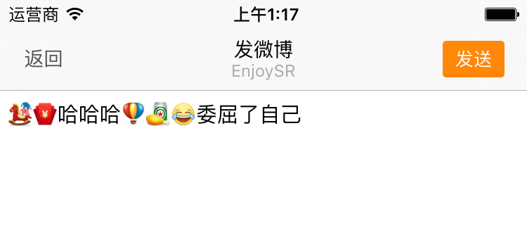

# 图文混排

## 实现效果



## 表情按钮点击事件

- 在 `HMEmoticonPageCell` 中监听表情按钮点击 -- 在添加按钮的时候添加

```swift
/// 添加表情按钮
private func addEmoticonButtons(){
    for _ in 0..<HMEmoticonPageNum {
        let button = UIButton()
        // 添加点击事件
        button.addTarget(self, action: "emoticonButtonClick:", forControlEvents: UIControlEvents.TouchUpInside)
        // 设置字体大小
        button.titleLabel?.font = UIFont.systemFontOfSize(36)
        contentView.addSubview(button)
        emoticonButtons.append(button)
    }
}
```

- 实现点击方法

```swift
/// 表情按钮点击
///
/// - parameter button: <#button description#>
@objc private func emoticonButtonClick(button: UIButton) {
    printLog("表情按钮点击了")
}
```

- 接下来需要做哪些事情？
    - 取到按钮对应的表情模型
        - 自定义 button，添加一个属性记住当前显示的表情模型
    - 将表情模型发送给发微博控制器
        - 利用通知的形式
    - 控制器中添加表情到 `textView` 中
        - 使用 NSAttributedString

- 自定义表情按钮 `HMEmoticonButton`

```swift
class HMEmoticonButton: UIButton {

    var emoticon: HMEmoticon?
}
```

- 更改 `HMEmoticonPageCell` 中 `emoticonButtons` 数据类型

```swift
// 装有所有表情按钮的集合
private lazy var emoticonButtons: [HMEmoticonButton] = [HMEmoticonButton]()
```


- 在给 `HMEmoticonPageCell` 设置数据的时候给每一个表情按钮设置数据

```swift
// 遍历当前设置的表情数据
for (index,value) in emoticons!.enumerate() {
    let button = emoticonButtons[index]
    // 设置表情属性
    button.emoticon = value
    // 显示当前遍历到的表情按钮
    button.hidden = false
    if !value.isEmoji {
        let image = UIImage(named: "\(value.path!)/\(value.png!)")
        button.setImage(image, forState: UIControlState.Normal)
        button.setTitle(nil, forState: UIControlState.Normal)
    }else{
        button.setImage(nil, forState: UIControlState.Normal)
        button.setTitle((value.code! as NSString).emoji(), forState: UIControlState.Normal)
    }
}
```

- 提取显示表情的逻辑到 `HMEmoticonButton` 中的 `emoticon` 的 `didSet` 方法中

```swift
var emoticon: HMEmoticon? {
    didSet{
        // 显示表情数据
        if !emoticon!.isEmoji {
            let image = UIImage(named: "\(emoticon!.path!)/\(emoticon!.png!)")
            self.setImage(image, forState: UIControlState.Normal)
            self.setTitle(nil, forState: UIControlState.Normal)
        }else{
            self.setImage(nil, forState: UIControlState.Normal)
            self.setTitle((emoticon!.code! as NSString).emoji(), forState: UIControlState.Normal)
        }
    }
}
```

- 更改 `HMEmoticonPageCell` 中 `emoticons` 的 `didSet` 方法

```swift
/// 当前页显示的表情数据
var emoticons: [HMEmoticon]? {
    didSet{

        // 先隐藏所有的表情按钮
        for value in emoticonButtons {
            value.hidden = true
        }

        // 遍历当前设置的表情数据
        for (index,value) in emoticons!.enumerate() {
            let button = emoticonButtons[index]
            // 设置表情属性
            button.emoticon = value
            // 显示当前遍历到的表情按钮
            button.hidden = false
        }
    }
}
```

- 在 `CommonTools` 中添加表情按钮点击通知

```swift
// 表情按钮点击通知
let HMEmoticonDidSelectedNotification = "HMEmoticonDidSelectedNotification"
```


- 监听表情按钮点击，发送通知

```swift
/// 表情按钮点击
@objc private func emoticonButtonClick(button: HMEmoticonButton) {
    //发送表情按下的通知
    NSNotificationCenter.defaultCenter().postNotificationName(HMEmoticonDidSelectedNotification, object: self, userInfo: ["emoticon": button.emoticon!])
}
```

- `HMComposeViewController` 注册通知

```swift
// 监听表情按钮点击的通知
NSNotificationCenter.defaultCenter().addObserver(self, selector: "emoticonDidSelected:", name: HMEmoticonDidSelectedNotification, object: nil)
```

- 添加通知调用的方法

```swift
/// 表情按钮点击发送通知监听的方法
@objc private func emoticonDidSelected(noti: NSNotification){
    // 需要重写 `HMEmoticon` 的 description 属性
    printLog(noti.userInfo!["emoticon"])
}
```
> 运行测试

- 图文混排逻辑
    1. 通过现有的 `attributedText` 初始化一个 `NSMutableAttributedString`
    2. 通过表情图片初始化一个 `NSTextAttachment` 对象
    3. 通过第 2 步的 `attachment` 对象初始化一个 `NSAttributedString`
    4. 将第 3 步的 `attributedString` 添加到第 1 步的可变的 `NSMutableAttributedString`
    5. 将第 4 步的结果赋值给 `textView` 的 `attributedText`

> 注意区分 `emoji` 表情与图片表情

- 以下代码都是在 `emoticonDidSelected` 方法中测试

```swift
/// 表情按钮点击发送通知监听的方法
@objc private func emoticonDidSelected(noti: NSNotification){
    printLog(noti.userInfo!["emoticon"])
    // 判断 emoticon 是否为空
    guard let emoticon = noti.userInfo!["emoticon"] as? HMEmoticon else {
        return
    }

    if !emoticon.isEmoji {
        // 通过原有的文字初始化一个可变的富文本
        let originalAttributedString = NSMutableAttributedString(attributedString: textView.attributedText)

        // 通过表情模型初始化一个图片
        let image = UIImage(named: "\(emoticon.path!)/\(emoticon.png!)")
        // 初始化文字附件，设置图片
        let attatchment = NSTextAttachment()
        attatchment.image = image

        // 通过文字附件初始化一个富文本
        let attributedString = NSAttributedString(attachment: attatchment)
        // 添加到原有的富文本中
        originalAttributedString.appendAttributedString(attributedString)

        // 设置 textView 的 attributedText
        textView.attributedText = originalAttributedString
    }else{
        // emoji 表情
    }
}
```
> 运行测试：图片太大

- 调整图片大小

```swift
// 图片宽高与文字的高度一样
let imageWH = textView.font!.lineHeight
// 调整图片大小
attatchment.bounds = CGRectMake(0, 0, imageWH, imageWH)
```

> 运行测试：当输入第二个表情的时候图片大小变小了，没有指定 `attributedString` 的字体大小

- 指定表情的 `attributedString` 的字体大小

```
// 通过文字附件初始化一个富文本
let attributedString = NSMutableAttributedString(attributedString: NSAttributedString(attachment: attatchment))
// 设置添加进去富文本的字体大小
attributedString.addAttribute(NSFontAttributeName, value: textView.font!, range: NSMakeRange(0, 1))
```

> 运行测试：发现表情图片偏上，调整 `attachment` 的 `bounds`

```swift
// 调整图片大小 --> 解决图片大小以及偏移问题
attatchment.bounds = CGRectMake(0, -4, imageWH, imageWH)
```

> 运行测试：发现当光标不在最后一位的时候，表情图片依然拼在最后面，解决办法就是调用 `NSMutableAttributedString` 的 `insertAttributedString` 的方法，传入 `index` 就是当前 textView 的选中范围的 `location`

- 解决当光标不在最后一位的时候表情图片拼接问题

```swift
// 添加到原有的富文本中
// originalAttributedString.appendAttributedString(attributedString)
// 解决当光标不在最后一位的时候添加图片表情的问题
let selectedRange = textView.selectedRange
originalAttributedString.insertAttributedString(attributedString, atIndex: selectedRange.location)
```

> 运行测试：当添加图片到光标位置的时候，光标移动到最后一个去了，解决方法：在设置完 textView 的富文本之后调用 `selectedRange`

- 设置完富文本之后更新 `selectedRange`

```swift
var selectedRange = textView.selectedRange
originalAttributedString.insertAttributedString(attributedString, atIndex: selectedRange.location)

// 设置 textView 的 attributedText
textView.attributedText = originalAttributedString
// 更新光标所在位置
selectedRange.location += 1
textView.selectedRange = selectedRange
```

> 运行测试：如果选中某一段字符，然后再次输入表情的话，需要用表情把选中的字符替换掉

- 在输入表情的时候，使用表情替换当前选中的文字

```swift
// 添加到原有的富文本中
// originalAttributedString.appendAttributedString(attributedString)
var selectedRange = textView.selectedRange
// 解决当光标不在最后一位的时候添加图片表情的问题
// originalAttributedString.insertAttributedString(attributedString, atIndex: selectedRange.location)
// 解决 textView 选中文字之后输入表情产生的 bug
originalAttributedString.replaceCharactersInRange(selectedRange, withAttributedString: attributedString)

// 设置 textView 的 attributedText
textView.attributedText = originalAttributedString
// 更新光标所在位置，以及选中长度
selectedRange.location += 1
selectedRange.length = 0
textView.selectedRange = selectedRange
```
> 运行测试

- 显示 Emoji 表情

```swift
if !emoticon.isEmoji {
    ...
}else{
    // emoji 表情
    textView.insertText((emoticon.code! as NSString).emoji())
}
```

> 运行测试

- 监听键盘里面删除按钮点击
    - 发送删除按钮点击的通知
    - 在 `HMComposeViewController` 中监听通知
    - 在通知的方法中调用 `textView` 的 `deleteBackward` 方法

- 在 `HMEmoticonPageCell` 中给删除按钮添加点击事件

```swift
deleteButton.addTarget(self, action: "deleteButtonClick:", forControlEvents: UIControlEvents.TouchUpInside)
```
- 在 `CommonTools` 中添加常量 `HMEmoticonDeleteButtonDidSelectedNotification`

```swift
// 删除按钮点击通知
let HMEmoticonDeleteButtonDidSelectedNotification = "HMEmoticonDeleteButtonDidSelectedNotification"
```

- 点击事件执行的方法

```swift
@objc private func deleteButtonClick(button: UIButton){
    //发送表情按下的通知
    NSNotificationCenter.defaultCenter().postNotificationName(HMEmoticonDeleteButtonDidSelectedNotification, object: self)
}
```

- 在 `HMComposeViewController` 中监听通知

```swift
// 监听删除按钮的通知
NSNotificationCenter.defaultCenter().addObserver(self, selector: "deletedButtonSelected:", name: HMEmoticonDeleteButtonDidSelectedNotification, object: nil)
```

- 添加通知调用的方法

```swift
// 删除按钮点击的通知
@objc private func deletedButtonSelected(noti: NSNotification){
    textView.deleteBackward()
}
```
> 运行测试

- 抽取代码，自定义 `HMEmoticonTextView` 继承于 `HMTextView`，在内部提供 `insertEmoticon` 的方法

```swift
class HMEmoticonTextView: HMTextView {

    /// 向当前 textView 添加表情
    ///
    /// - parameter emoticon: 表情模型
    func insertEmoticon(emoticon: HMEmoticon) {

    }
}
```

- 更改 `HMComposeViewController` 中 `textView` 的类型

```swift
/// 输入框
private lazy var textView: HMEmoticonTextView = {
    let textView = HMEmoticonTextView()
    textView.placeholder = "听说下雨天音乐和辣条更配哟~"
    textView.font = UIFont.systemFontOfSize(16)
    textView.alwaysBounceVertical = true
    textView.delegate = self
    return textView
}()
```


- 将 `HMComposeViewController` 中的 添加表情的代码移植到以 `HMEmoticonTextView` 中的 `insertEmoticon` 方法中

```swift
// 向当前 textView 添加表情
///
/// - parameter emoticon: 表情模型
func insertEmoticon(emoticon: HMEmoticon) {
    if !emoticon.isEmoji {
        // 通过原有的文字初始化一个可变的富文本
        let originalAttributedString = NSMutableAttributedString(attributedString: attributedText)

        // 通过表情模型初始化一个图片
        let image = UIImage(named: "\(emoticon.path!)/\(emoticon.png!)")
        // 初始化文字附件，设置图片
        let attatchment = NSTextAttachment()
        attatchment.image = image
        // 图片宽高与文字的高度一样
        let imageWH = font!.lineHeight
        // 调整图片大小 --> 解决图片大小以及偏移问题
        attatchment.bounds = CGRectMake(0, -4, imageWH, imageWH)

        // 通过文字附件初始化一个富文本
        let attributedString = NSMutableAttributedString(attributedString: NSAttributedString(attachment: attatchment))
        // 设置添加进去富文本的字体大小
        attributedString.addAttribute(NSFontAttributeName, value: font!, range: NSMakeRange(0, 1))

        // 添加到原有的富文本中
        //            originalAttributedString.appendAttributedString(attributedString)
        var selectedRange = self.selectedRange
        // 解决当光标不在最后一位的时候添加图片表情的问题
        //            originalAttributedString.insertAttributedString(attributedString, atIndex: selectedRange.location)
        // 解决 textView 选中文字之后输入表情产生的 bug
        originalAttributedString.replaceCharactersInRange(selectedRange, withAttributedString: attributedString)

        // 设置 textView 的 attributedText
        attributedText = originalAttributedString
        // 更新光标所在位置，以及选中长度
        selectedRange.location += 1
        selectedRange.length = 0
        self.selectedRange = selectedRange

    }else{
        // emoji 表情
        insertText((emoticon.code! as NSString).emoji())
    }
}
```

- 在 `HMComposeViewController` 中表情点击的方法

```swift
/// 表情按钮点击发送通知监听的方法
@objc private func emoticonDidSelected(noti: NSNotification){
    // 判断 emoticon 是否为空
    guard let emoticon = noti.userInfo!["emoticon"] as? HMEmoticon else {
        return
    }
    textView.insertEmoticon(emoticon)
}
```

> 运行测试：当输入图片表情的时候，占位文字并没有隐藏，解决方法，在 `insertEmoticon` 方法最后调用代理，发送通知

- 添加完表情之后，调用代理，发送通知

```swift
// 调用代理
// OC 写法
// if let del = self.delegate where del.respondsToSelector("textViewDidChange:"){
//     del.textViewDidChange!(self)
// }

// Swift 写法
self.delegate?.textViewDidChange?(self)
// 发送通知
NSNotificationCenter.defaultCenter().postNotificationName(UITextViewTextDidChangeNotification, object: self)

```

> 运行测试


