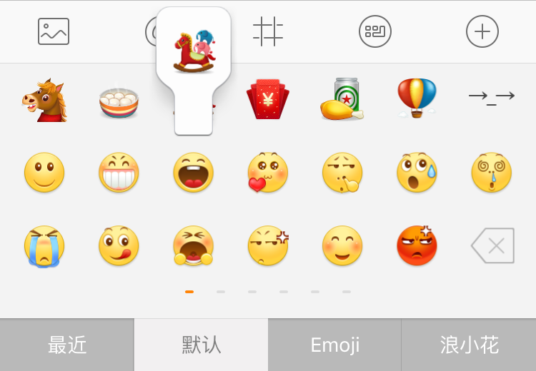
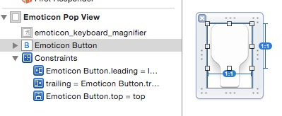

# 表情点击气泡

- 功能1：在点击表情按钮的时候弹出一个气泡
- 功能2：在长按滑动的时候气泡随着手指移动

## 实现效果




## 点击表情按钮弹出一个气泡

### 实现思路

1. 气泡可以使用 xib 实现
2. 点击表情按钮的时候取到对应表情按钮的位置
3. 将位置转化成在 window 上的位置
4. 根据将气泡添加到最上层的 Window 上
5. 0.1 秒之后气泡从 window 上移除


### 代码实现

- 使用 xib 实现弹出的视图 `HMEmoticonPopView`



> 将此 View 的背景设置成透明色,并将 button 的类型设置成 `HMEmoticonButton`

- 连线到 `HMEmoticonPopView.swift`，并提供从 xib 加载的方法

```swift
class HMEmoticonPopView: UIView {

    @IBOutlet weak var emoticonButton: HMEmoticonButton!

    class func popView() -> HMEmoticonPopView {
        let result = NSBundle.mainBundle().loadNibNamed("HMEmoticonPopView", owner: nil, options: nil).last! as! HMEmoticonPopView
        return result
    }
}
```

- 监听表情按钮点击，初始化控件，将控件添加到 window 上

```swift
// MARK: - 监听事件

@objc private func emoticonButtonClick(button: HMEmoticonButton){
    printLog("表情按钮点击")
    if let emoticon = button.emoticon {
        ...
        // 初始化 popView
        let popView = HMEmoticonPopView.popView()

        // 将 popView 添加到 window 上
        let window = UIApplication.sharedApplication().windows.last!
        window.addSubview(popView)

        // 0.1 秒消失
        dispatch_after(dispatch_time(DISPATCH_TIME_NOW, Int64(0.1 * Double(NSEC_PER_SEC))), dispatch_get_main_queue()) { () -> Void in
            popView.removeFromSuperview()
        }
    }
}
```

- 显示的位置不对：取到 button 在屏幕上的位置,并设置 popView 的位置

```swift
let rect = button.convertRect(button.bounds, toView: nil)
popView.centerX = CGRectGetMidX(rect)
popView.y = CGRectGetMaxY(rect) - popView.height
```
> 运行测试

- 显示数据: 给 `popView` 添加 `emoticon` 属性

```swift
var emoticon: HMEmoticon? {
    didSet{
        emoticonButton.emoticon = emoticon
    }
}
```

- 提取显示 `popView` 代码到 `HMEmoticonButton` 中

```swift
/// 将传入的 PopView 显示在当前按钮之上
///
/// - parameter popView: popView
func showPopView(popView: HMEmoticonPopView){
    // 获取到 button 按钮在屏幕上的位置
    let rect = convertRect(bounds, toView: nil)
    // 设置位置
    popView.centerX = CGRectGetMidX(rect)
    popView.y = CGRectGetMaxY(rect) - popView.height
    // 设置表情数据
    popView.emoticon = emoticon
    // 添加到 window 上
    let window = UIApplication.sharedApplication().windows.last!
    window.addSubview(popView)
}
```

- 外界调用

```swift
@objc private func emoticonButtonClick(button: HMEmoticonButton){
    printLog("表情按钮点击")
    if let emoticon = button.emoticon {
        ...
        // 初始化 popView
        let popView = HMEmoticonPopView.popView()
        // 显示 popView
        button.showPopView(popView)
        // 0.25 秒消失
        dispatch_after(dispatch_time(DISPATCH_TIME_NOW, Int64(0.25 * Double(NSEC_PER_SEC))), dispatch_get_main_queue()) { () -> Void in
            popView.removeFromSuperview()
        }
    }
}
```


## 长按滑动的时候气泡随着手指移动

### 实现思路

1. 懒加载一个 `popView` 供长按拖动的时候显示
2. 监听 cell 的长按 -> 添加长按手势
3. 在手势监听方法里面取到手指的位置
4. 判断手指的位置在哪一个按钮之上
5. 调用对应按钮的 `showPopView` 方法
6. 在手势结束的时候隐藏 `popView`

### 代表实现

- 懒加载一个 `popView` 供长按拖动的时候显示

```swift
/// 长按显示的 popView
private lazy var popView = HMEmoticonPopView.popView()
```

- 给当前 cell 的 contentView 添加长按手势

```swift
// 添加长按手势事件
let longGes = UILongPressGestureRecognizer(target: self, action: "longPress:")
contentView.addGestureRecognizer(longGes)
```
- 监听手势事件，取到手指的位置

```swift
/// 长按手势监听
///
/// - parameter ges: 手势
@objc private func longPress(ges: UILongPressGestureRecognizer) {
    // 获取当前手势在指定 view 上的位置
    let location = ges.locationInView(contentView)
    printLog(location)
}
```

- 在 `longPress` 方法内部提供通过位置查找按钮的方法

```swift
/// 长按手势监听
///
/// - parameter ges: 手势
@objc private func longPress(ges: UILongPressGestureRecognizer) {

    /// 根据位置查找到对应位置的按钮
    ///
    /// - parameter location: 位置
    func findButtonWithLocation(location: CGPoint) -> HMEmoticonButton? {
        for value in emoticonButtons {
            if CGRectContainsPoint(value.frame, location) {
                return value
            }
        }
        return nil
    }
    // 获取当前手势在指定 view 上的位置
    let location = ges.locationInView(contentView)
}
```

- 监听手势状态

```swift
switch ges.state {
case .Began,.Changed:
    // 通过手势的位置查找到对应的按钮
    guard let button = findButtonWithLocation(location) where button.hidden == false else {
        return
    }
    popView.hidden = false
    button.showPopView(popView)
case .Ended:
    popView.hidden = true
    // 通过手势的位置查找到对应的按钮
    guard let button = findButtonWithLocation(location) where button.hidden == false else {
        return
    }
    emoticonButtonClick(button)
default:
    // 将 popView 隐藏
    popView.hidden = true
    break
}
```


