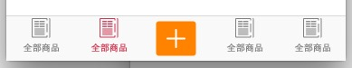
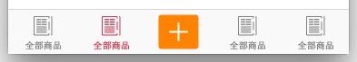

# UITabBar调整

##遇到问题：
* tabBar上的`图片与文字`显示的颜色不对，应该怎么去调整？

##调整方式：
* 第1种.一起设置

```swift
//设置UITabBar的TintColor属性
UITabBar.appearance().tintColor = UIColor.orangeColor()
```
这种方式可以把TabBar上显示的图片与文字的颜色一并设置

* 第2种.分开设置
    * 设置图片：
        * 设置图片按原来的颜色渲染：
        设置tabBarItem的selectedImage属性的时候


```swift
//UIImageRenderingMode --> 渲染模式
//设置默认的图片
vc.hildController.tabBarItem.image = UIImage(named: imageName)?.imageWithRenderingMode(UIImageRenderingMode.AlwaysOriginal)
//设置选中的图片
vc.tabBarItem.selectedImage = UIImage(named: "\(imageName)_selected")?.imageWithRenderingMode( UIImageRenderingMode.AlwaysOriginal)
```
* 也可以在Assets.xcassets目录下，找到对应图片，利用右边控制面板设置其渲染的模式：
<!--needpicture-->
* 设置文字：可以利用tabBarItem的`setTitleTextAttributes`方法给title添加属性

```swift
//文字颜色的属性
let textColorAttr = [
    NSForegroundColorAttributeName: UIColor.orangeColor()
]
//设置选中文字颜色
vc.tabBarItem.setTitleTextAttributes(textColorAttr, forState: UIControlState.Selected)
```
* 可以利用这种方法调整UItabBar上的文字大小：

```swift
//设置字体的属性
let textFontAttr = [
    NSFontAttributeName: UIFont.systemFontOfSize(12)
]
vc.tabBarItem.setTitleTextAttributes(textFontAttr, forState: UIControlState.Normal)
```

`注意：后面state是Normal`

第2种方式更加灵活，可以应对UITabBar上图片颜色不一样的设计

##其他

如果以后在公司里面开发，美工给的切图是`把文字与图标切在一张图片上`的，如：


这个时候我们只设置tabBarItem的image(或者selectedImage)的话，图片会显示 在上半部分的位置：



解决方法：
```swift
//设置偏移量,解决把图片放在tabBar中间的问题
childController.tabBarItem.imageInsets = UIEdgeInsetsMake(5, 0, -5, 0)
```




