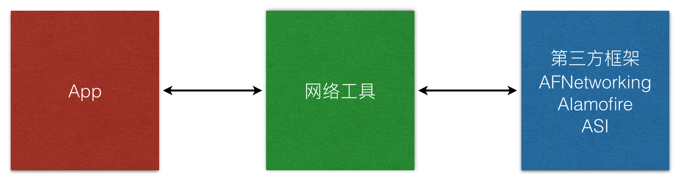

# AFNetworking

## ATS 设置

```plist
<key>NSAppTransportSecurity</key>
<dict>
  <!--Include to allow all connections (DANGER)-->
  <key>NSAllowsArbitraryLoads</key>
      <true/>
</dict>
```

## 封装网络框架的必要性

* 在应用程序开发中，一定要封装隔离网络框架
* 示意图如下：



## OC 封装网络工具

* 新建网络工具类 `NetworkTools`
* 实现单例

```objc
+ (instancetype)sharedTools {

    static NetworkTools *instance;

    static dispatch_once_t onceToken;
    dispatch_once(&onceToken, ^{
        instance = [[NetworkTools alloc] initWithBaseURL:nil];

        instance.responseSerializer.acceptableContentTypes = [instance.responseSerializer.acceptableContentTypes setByAddingObject:@"text/html"];
    });

    return instance;
}
```

* 建立网络请求方法

```objc
- (void)request:(NSString *)URLString parameters:(id)parameters finished:(void (^)(id result, NSError *error))finished {

    NSAssert(finished != nil, @"必须输入完成回调");

    [self GET:URLString parameters:parameters success:^(NSURLSessionDataTask * _Nonnull task, id  _Nonnull responseObject) {
        finished(responseObject, nil);
    } failure:^(NSURLSessionDataTask * _Nonnull task, NSError * _Nonnull error) {
        finished(nil, error);
    }];
}
```

* 测试网络请求

```objc
[[NetworkTools sharedTools] request:@"http://www.weather.com.cn/data/sk/101010100.html" parameters:nil finished:^(id result, NSError *error) {
    NSLog(@"%@ %@", result, error);
}];
```

* 定义 HTTP 请求枚举类型

```swift
/// 网络请求枚举类型
typedef enum : NSUInteger {
    GET,
    POST,
} HMRequestMethod;
```

* 从 `AFHTTPSessionManager.m` 中复制 `dataTaskWithHTTPMethod` 函数定义

```swift
@protocol NetworkToolsProxy <NSObject>

/// AFN 内部网络请求方法
///
/// @param method     请求方法
/// @param URLString  URLString
/// @param parameters 参数字典
/// @param success    成功回调
/// @param failure    失败回调
///
/// @return NSURLSessionDataTask，需要 resume
@optional
- (NSURLSessionDataTask *)dataTaskWithHTTPMethod:(NSString *)method
                                       URLString:(NSString *)URLString
                                      parameters:(id)parameters
                                         success:(void (^)(NSURLSessionDataTask *, id))success
                                         failure:(void (^)(NSURLSessionDataTask *, NSError *))failure;

@end
```

* 修改 `request` 方法

```objc
- (void)request:(HMRequestMethod)method URLString:(NSString *)URLString parameters:(id)parameters finished:(void (^)(id result, NSError *error))finished {

    NSAssert(finished != nil, @"必须输入完成回调!");

    NSString *methodName = (method == GET) ? @"GET" : @"POST";

    [[self dataTaskWithHTTPMethod:methodName URLString:URLString parameters:parameters success:^(NSURLSessionDataTask *task, id responseObject) {

        finished(responseObject, nil);
    } failure:^(NSURLSessionDataTask *task, NSError *error) {

        NSLog(@"%@", error);
        finished(nil, error);
    }] resume];
}
```

* 测试 GET 请求

```objc
[[NetworkTools sharedTools] request:GET URLString:@"http://www.weather.com.cn/data/sk/101010100.html" parameters:nil finished:^(id result, NSError *error) {

    NSLog(@"%@ %@", result, error);
}];
```

* 测试 POST 请求

```objc
[[NetworkTools sharedTools] request:POST URLString:@"http://httpbin.org/post" parameters:@{@"name": @"zhangsan", @"age": @18} finished:^(id result, NSError *error) {

    NSLog(@"%@ %@", result, error);
}];
```

## Swift 封装网络工具

* 网络请求方法枚举

```swift
/// 请求方法
enum HMRequestMethod: String {
    case GET = "GET"
    case POST = "POST"
}
```

* 单例 & 响应格式设置方法

```swift
/// 网络工具类
class NetworkTools: AFHTTPSessionManager {

    /// 网络工具单例
    static let sharedTools: NetworkTools = {

        let tools = NetworkTools(baseURL: nil)

        tools.responseSerializer.acceptableContentTypes?.insert("text/html")

        return tools
    }()
}
```

* AFN 内部方法封装

```swift
// MARK: - 封装 AFN 内部方法
extension NetworkTools {

    /// 请求回调
    typealias RequestCallBack = (result: AnyObject?, error: NSError?) -> ()

    /// 网络请求方法
    ///
    /// - parameter method:     请求方法 GET / POST
    /// - parameter URLString:  URLString
    /// - parameter parameters: 参数字典
    /// - parameter finished:   完成回调
    func request(method: HMRequestMethod, URLString: String, parameters: [String: AnyObject]?, finished:RequestCallBack) {

        // 成功回调
        let success = { (task: NSURLSessionDataTask, result: AnyObject) -> Void in
            finished(result: result, error: nil)
        }
        // 失败回调
        let failure = { (task: NSURLSessionDataTask, error: NSError) -> Void in
            print(error)

            finished(result: nil, error: error)
        }

        if method == HMRequestMethod.GET {

            GET(URLString, parameters: parameters, success: success, failure: failure)
        } else {
            POST(URLString, parameters: parameters, success: success, failure: failure)
        }
    }
}
```

### 小结

* 使用 `typealias` 可以统一和简化闭包的定义和传递
* 使用 `baseURL` 能够简化网络访问方法中 URL 的传递
* AFN 访问方法最常见的错误
    * `status code == 200`，但是提示 `unacceptable content-type`，表示网络访问正常，但是无法对返回数据做反序列化
    * 解决办法：增加 反序列化数据 格式
* 另外一个常见错误
    * `status code == 405`，不支持的网络请求方法，检查 GET / POST 是否写错
