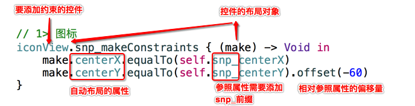

# SnapKit

`SnapKit` 是 `Masonry` 框架的团队针对 Swift 全新开发的一套自动布局框架

* 官方网站：http://snapkit.io
* github网站：https://github.com/SnapKit/SnapKit
* 文档地址：http://snapkit.io/docs/

* SnapKit语法示意图如下：



## 代码演练

* 使用 `SnapKit` 替换访客视图中的自动布局代码

* 导入框架

```swift
import SnapKit
```

* 设置布局

```swift
// 2.1 图标
iconView.snp_makeConstraints { (make) -> Void in
    make.center.equalTo(self)
}
// 2.2 圆圈
circleView.snp_makeConstraints { (make) -> Void in
    make.center.equalTo(iconView)
}
// 2.3 消息
messageLabel.snp_makeConstraints { (make) -> Void in
    make.width.equalTo(224)
    make.top.equalTo(circleView.snp_bottom).offset(16)
    make.centerX.equalTo(circleView)
}
// 2.4 注册按钮
registerButton.snp_makeConstraints { (make) -> Void in
    make.leading.equalTo(messageLabel)
    make.top.equalTo(messageLabel.snp_bottom).offset(16)
    make.size.equalTo(CGSizeMake(100, 35))
}
// 2.5 登录按钮
loginButton.snp_makeConstraints { (make) -> Void in
    make.trailing.equalTo(messageLabel)
    make.centerY.equalTo(registerButton)
    make.size.equalTo(CGSizeMake(100, 35))
}
// 2.6 阴影按钮
maskIconView.snp_makeConstraints { (make) -> Void in
    make.top.equalTo(self)
    make.bottom.equalTo(registerButton)
    make.width.equalTo(self)
}
```
