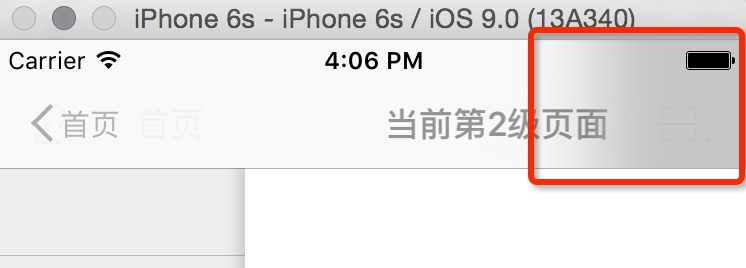

# 自定义导航控制器

## 课程目标
自定义 `UINavigationController`，实现新浪微博左上角返回按钮逻辑
* 如果是从一级页面进入到二级页面，第二级页面左上角返回按钮显示`一级页面的title`
* 如果是从二级页面进入到三级页面(或者层次更深)，进入页面的左上角返回按钮显示`返回`

## 分析
* 如果要在每一个控制器里面分别设置的话，代码烦琐而且扩展性不强，所以写一个自己的 `UINavigationController`
* 新push进入的控制器都会经过 `UINavigationController` 的 `pushViewController(viewController: UIViewController, animated: Bool)` 方法
* 可以在这个方法里面判断当前是 push 进入的是第几级控制器，并设置不同的返回按钮title

## 代码
```swift
import UIKit

class HMNavigationController: UINavigationController {

    /**
    重写此方法，在里面统一返回按钮逻辑

    - parameter viewController: 将要push进来的控制器
    - parameter animated:       是否需要动画
    */
    override func pushViewController(viewController: UIViewController, animated: Bool) {

        // 如果当前里面有控制器，才执行下面的逻辑
        if childViewControllers.count > 0 {

            var title = "返回"

            if childViewControllers.count == 1 {
                //正要往里面添加第二个控制器
                title = childViewControllers.first?.title ?? "返回"
            }
            // push第二个或者以后控制器隐藏底部tabBar
            viewController.hidesBottomBarWhenPushed = true
            // 设置左边item
            viewController.navigationItem.leftBarButtonItem = UIBarButtonItem(imgName: "navigationbar_back_withtext", title: title, target: self, action: "back")

        }
        super.pushViewController(viewController, animated: animated)
    }

    @objc private func back(){
        popViewControllerAnimated(true)
    }
}

```
> 在 HMMainViewController 添加子控制器的地方，使用自己定义的导航控制器

* 默认push控制器的时候，顶部右边会出现部分阴影：



解决方法：

```swift
// 给tabBar(或者navigationBar)设置一张背景图片
// HMMainViewController->ViewDidLoad()方法里面
let tab = HMTabBar()
// 设置撰写按钮点击的事件响应
tab.composeButtonClickBlock = {
    print("撰写按钮点击")
}
// 设置背景图片，去掉顶部阴影的效果
tab.backgroundImage = UIImage(named: "tabbar_background")
setValue(tab, forKey: "tabBar")

```
