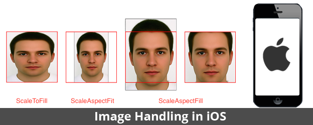

# 发现页面搜索框

## 课程目标

- 明确 Xib 创建视图的流程
- IBInspectable&IBDesignable使用

## 代码实现

- 新建 `HMDiscoverSearchView` 继承于 `UIView`

```swift
class HMDiscoverSearchView: UIView,UITextFieldDelegate {

}
```

- 新建 Xib 文件 `HMDiscoverSearchView.xib`


1. 拖入 `UITextField` 作输入框
- 拖入 `UIButton` 作取消按钮
- 添加相关约束
- 指定 class 为 `HMDiscoverSearchView`
- 连线

```swift
@IBOutlet weak var textField: UITextField!
@IBOutlet weak var cancelButton: UIButton!
```

- 在 `HMDiscoverSearchView` 提供类方法通过 xib 创建 view

```swift
class func searchView() -> HMDiscoverSearchView {
    let view = NSBundle.mainBundle().loadNibNamed("HMDiscoverSearchView", owner: nil, options: nil).last! as! HMDiscoverSearchView
    return view;
}
```

- 在 `HMDiscoverTableViewController` 添加方法，测试此View的显示

```swift
private func setupUI(){
    let searchView = HMDiscoverSearchView.searchView()
    searchView.frame = CGRectMake(0, 0, UIScreen.mainScreen().bounds.size.width, 35)
    navigationItem.titleView = searchView
}
```

- 设置 `textfield` 的左边放大镜视图

```swift
private lazy var leftImage: UIImageView = {
    return UIImageView(image: UIImage(named: "searchbar_textfield_search_icon")!)
}()

...
override func awakeFromNib() {
    // 设置 textField 的左边视图
    leftImage.frame = CGRectMake(0, 0, frame.height, frame.height)
    leftImage.contentMode = .Center
    textField.leftView = leftImage
    // 设置显示模型
    textField.leftViewMode = UITextFieldViewMode.Always
}
```

- 设置 textField 的代理，实现代理方法

```swift
class HMDiscoverSearchView: UIView,UITextFieldDelegate {
    ...

    func textFieldDidBeginEditing(textField: UITextField) {

    }
}

```

- 拖入 `textfield` 右边的约束到 view 中，在开始编辑的时候执行动画

```swift
@IBOutlet weak var textFieldRightCons: NSLayoutConstraint!
```

- 执行约束动画需要调用 view 的 layoutIfNeed

```swift
func textFieldDidBeginEditing(textField: UITextField) {
    textFieldRightCons.constant = cancelButton.frame.width
    // 执行动画
    UIView.animateWithDuration(0.25) { () -> Void in
        self.textField.layoutIfNeeded()
    }
}
```

- 拖入取消按钮的点击事件，点击的时候取消第一响应者并执行动画

```swift
@IBAction func cancelButtonClick(sender: UIButton) {
    textField.resignFirstResponder()
    textFieldRightCons.constant = 0

    // 执行动画
    UIView.animateWithDuration(0.25) { () -> Void in
        self.textField.layoutIfNeeded()
    }
}
```


## IBInspectable & IBDesignable

### IBInspectable

- 其修饰的属性可以在 XIB/SB 右边控制面板显示
- 可以重写该属性的 get/set 方法做自己的操作

### IBDesignable

- 其修饰自定义 View
- 可以在更改 `IBInspectable` 修饰的属性的时候动态在 XIB/SB 里面渲染


## 图片填充模式




