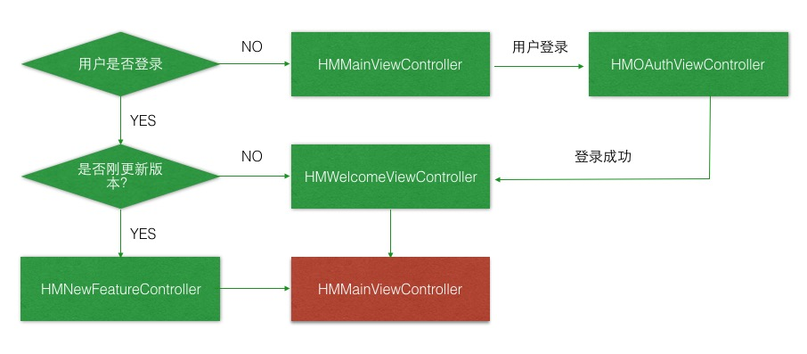

# 界面切换

## 界面切换流程图



## 代码实现

### AppDelegate

* 判断新版本

```swift
/// 检查是否新版本
private func isNewVersion() -> Bool {

    let versionKey = "sanboxVersionKey"

    // 先从沙盒里面取
    let sanboxVersion = NSUserDefaults.standardUserDefaults().objectForKey(versionKey) as? String
    // 取到本地的version
    let currentVersion = NSBundle.mainBundle().infoDictionary!["CFBundleShortVersionString"] as! String
    // 将当前版本写入到沙盒
    NSUserDefaults.standardUserDefaults().setObject(currentVersion, forKey: versionKey)

    // 如果已经有沙盒的版本号，并且沙盒的版本号不小于当前的版本号，代表不是新版本
    if let san = sanboxVersion where (san as NSString).compare(currentVersion) != NSComparisonResult.OrderedAscending {
        return false
    }
    return true
}
```

* 要显示的默认控制器

```swift
/// 返回默认要显示的ViewController (登录之后)
private func defaultViewController() -> UIViewController {
    return isNewVersion() ? HMNewFeatureViewController() : HMWelcomeViewController()
}
```

* 应用程序启动

```swift
// 判断是否登录，如果没有登录直接进入到主页
window?.rootViewController = HMUserAccountViewModel.sharedInstance.userLogon ? defaultViewController() : HMMainViewController()
```

### 多视图控制器切换

#### 定义通知

* 在 `CommonTools` 中定义通知常量

```swift
/// 界面切换通知
let HMSwithRootViewControllerNotifycation = "HMSwithRootViewControllerNotifycation"
```

* 注册通知

```swift
// 注册通知
NSNotificationCenter.defaultCenter().addObserver(self, selector: "switchRootViewController:", name: HMSwitchMainInterfaceNotification, object: nil)
```

* 注销通知

```swift
deinit {
    NSNotificationCenter.defaultCenter().removeObserver(self, name: HMSwitchMainInterfaceNotification, object: nil)
}
```

* 切换根视图控制器

```swift
/// 根据通知切换控制器
@objc private func switchRootViewController(notification: NSNotification) {
    printLog(notification)

    // TODO: - 切换控制器

}
```

#### 登录界面

```swift
// 4. 调用视图模型方法，获取 token 以及用户信息
HMUserAccountViewModel.sharedInstance.loadUserAccount(code, success: { () -> () in
    SVProgressHUD.dismiss()
    // 关闭控制器发送切换根控制器的通知
    self.dismissViewControllerAnimated(true, completion: { () -> Void in
        NSNotificationCenter.defaultCenter().postNotificationName(HMSwithRootViewControllerNotifycation, object: self)
    })
}, failure: { (error) -> () in
    print("请求失败:\(error)")
})
```

#### 欢迎界面

```swift
NSNotificationCenter.defaultCenter().postNotificationName(HMSwithRootViewControllerNotifycation, object: nil)
```

#### 新特性界面

```swift
NSNotificationCenter.defaultCenter().postNotificationName(HMSwithRootViewControllerNotifycation, object: nil)
```

#### 完成界面切换

```swift
/// 根据通知切换控制器
@objc private func switchRootViewController(noti: NSNotification){
    // 切换根控制器
    let vc = noti.object as? UIViewController
    window?.rootViewController = vc is HMOAuthViewController ? HMWelcomeViewController() : HMMainViewController()
}
```
