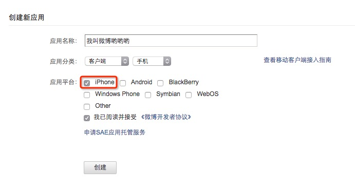
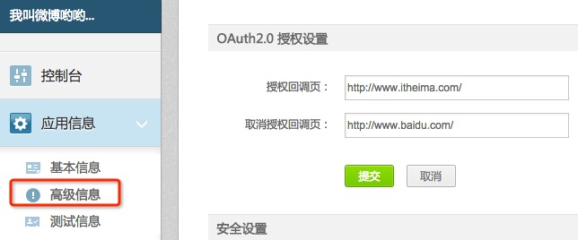
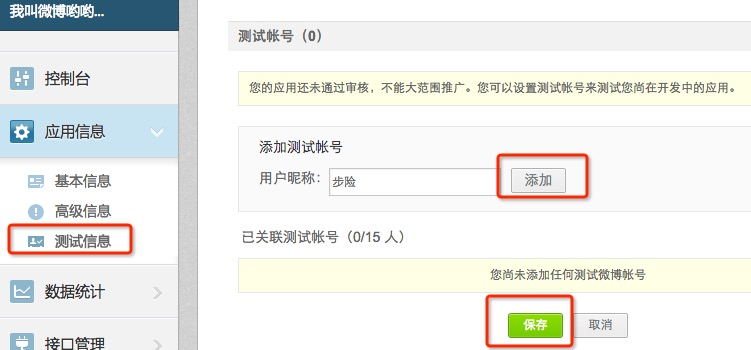

# 注册应用程序

## 注册应用程序

* 注册新浪微博账号
* 访问 http://open.weibo.com
* 成为新浪微博开发者(个人开发者)
* 点击 `微连接` - `移动应用`
* 填写基本信息，如下图所示：

* 点击 `应用信息` - `高级信息`，设置回调地址，如下图所示：

* 点击 `应用信息` - `测试信息`，添加测试账号，如下图所示：

> 在以后公司开发中，在应用未上线之前，别人测试应用使用微博账号的，要将其微博账号添加为测试账号，否则数据无法获取

## 应用程序信息

| Key | 值 |
| -- | -- |
| client_id | 931880914 |
| client_secret | 80328e91fb58750daa48b8f12a243b4f |
| redirect_uri | http://www.itheima.com/ |
| access_token | 2.00ml8IrFLUkOXB854496feced4yFtC |

> 注意：授权回调地址一定要完全一致
