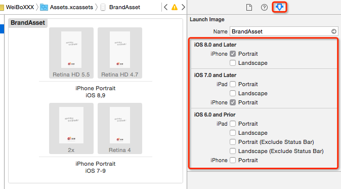
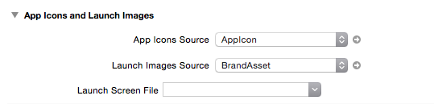
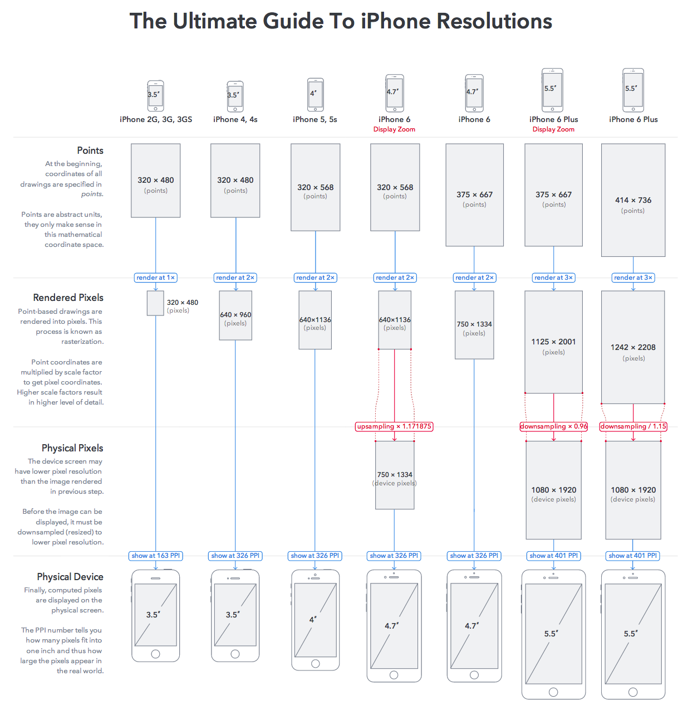

# 图标&启动图

##图标

### 添加图标

* Spotlight与Settings的图标可以不用配置
* 图片的尺寸一定要正确

##启动图(BrandAsset)

`LaunchScreen.storyboard 或者 LaunchScreen.xib 只支持iOS8以上的手机，在iOS8以下手机上无效`

现阶段需要做4个大小的启动图：

| 3.5(2x) | Retina 4 | Retina 4.7 | Retina 5.5 |
| -- | -- | -- | -- |
| 640 * 960 | 640 * 1136 | 750 * 1334 | 1242 * 2208 |

`坑：启动图的尺寸大小一定要对，不然设置无效`

* 1.如果没有配置启动图，运行到4s以上的手机上，上下会出现两条黑边。此时屏幕点坐标系的大小为｛320,480｝
* 2.如果没有配置5s及以上的启动图，会去往下找，找到4s的图之后，会把界面以4s启动图的大小显示出来，也会出现上下两条黑边。
* 3.如果没有配置6的启动图，运行到6上面：
    * 配置过5s启动图，会找到5s的启动图之后，会把界面以5s启动图的大小完整的显示出来。界面会被拉伸
    * 没有配置过5s启动图，效果如同1，是否有启动图由是否配置过4来决定
* 4.如果没有配置过6plus的启动图，运行到6上面：
    * 配置过6的启动图，不会显示启动图，界面正常
    * 没有配置过6的启动图，会往下找，找到5s则显示5s的启动图，界面被拉伸，如果都没找到，见第1条

###Display Room
`iPhone 6及以上`手机才有此功能
* 见设置->显示与亮度->显示模式->有标准与放大模式
* 如果设置成放大模式：
    * iPhone 6的手机里面跑的软件的点坐标系大小为｛320,568｝(5s大小)
    * iPhone 6plus的手机里面跑的软件的点坐标系大小为｛375,667｝(6大小)

###添加启动图

##设置启动图与图标

# 图片素材

## 素材对应的设备

| 1x | 2x | 3x |
| -- | -- | -- |
| 大小对应开发中的`点` | 宽高是 `1x` 的两倍 | 宽高时 `1x` 的三倍 |
| iPhone 3GS，可以省略 | iPhone 4 iPhone 4s iPhone 5 iPhone 5s iPhone 6  | iPhone 6+ |

## 与美工的配合

* 让美工在设计原型图时，按照 `iPhone 6+` 的分辨率设计
* 然后切图的时候，切两套即可
* 一套以 @3x 结尾，供 iPhone 6+ 使用
* 一套缩小 2/3，以 @2x 结尾，供小屏视网膜手机使用

> 提示：现在大多数应用程序还适配 iOS 6，下载的 ipa 包能够拿到图片素材，但是如果今后应用程序只支持 iOS 7+，解压缩包之后，择无法再获得对应的图片素材。

**请妥善保管好一些优秀作品的 IPA 文件**

##iOS手机分辨率与点坐标大小

