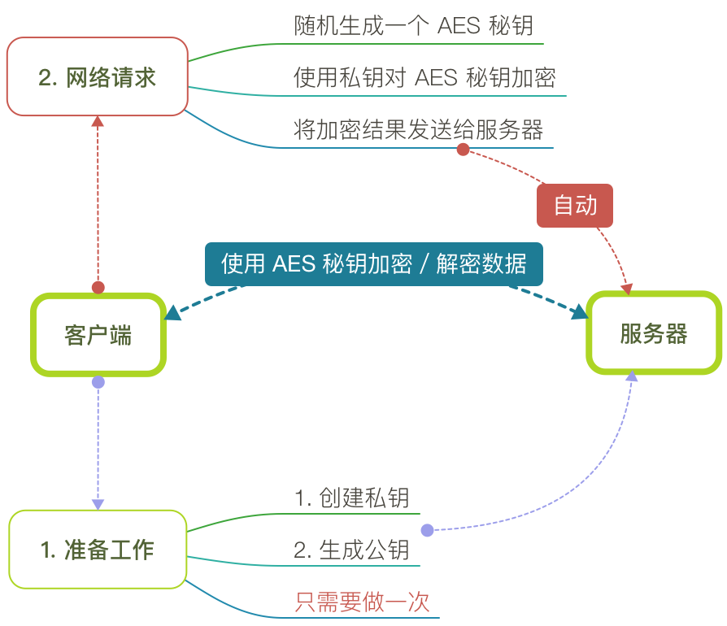

# 开源中国社区

## 官方网站

https://git.oschina.net/

* 开源中国社区成立于2008年8月，其目的是为中国的IT技术人员提供一个全面的、快捷更新的用来检索开源软件以及交流使用开源经验的平台
* 目前国内有很多公司会将公司的项目部署在 `OSChina`

### 与 `GitHUB` 的对比

1. 服务器在国内，速度更快
2. 免费账户同样可以建立 `私有` 项目，而 `GitHUB` 上要建立私有项目必须 `付费`

### 使用

* 注册账号
    * 建议使用网易的邮箱，使用其他免费邮箱可能会收不到验证邮件

* 添加 SSH 公钥



* 开源中国帮助文档地址：https://git.oschina.net/oschina/git-osc/wikis/帮助#ssh-keys

* 进入终端，并输入以下命令

```bash
# 切换目录，MAC中目录的第一个字符如果是 `.` 表示改文件夹是隐藏文件夹
$ cd ~/.ssh
# 查看当前目录文件
$ ls

# 生成 RSA 密钥对
# 1> "" 中输入个人邮箱
# 2> 提示输入私钥文件名称，直接回车
# 3> 提示输入密码，可以随便输入，只要本次能够记住即可
$ ssh-keygen -t rsa -C "xxx@126.com"

# 查看公钥内容
$ cat id_rsa.pub
```

* 将公钥内容复制并粘贴至 https://git.oschina.net/profile/sshkeys

* 测试公钥

```bash
# 测试 SSH 连接
$ ssh -T git@git.oschina.net

# 终端提示 `Welcome to Git@OSC, xxx!` 说明连接成功
```

* 新建项目
* 克隆项目

```bash
# 切换至项目目录
$ cd 项目目录

# 克隆项目，地址可以在项目首页复制
$ git clone git@git.oschina.net:xxx/ProjectName.git
```

* 添加 `gitignore`

```bash
# ~/dev/github/gitignore/ 是保存 gitignore 的目录
$ cp ~/dev/github/gitignore/Swift.gitignore .gitignore
```

* 提示：
    * 可以从 `https://github.com/github/gitignore` 获取最新版本的 `gitignore` 文件
    * 添加 `.gitignore` 文件之后，每次提交时不会将个人的项目设置信息（例如：末次打开的文件，调试断点等）提交到服务器，在团队开发中非常重要

* 常见命令

```bash
# 将项目克隆到本地
$ git clone xxx

# 添加到代码区
$ git add .

# 添加到版本库
$ git commit -m "注释"

# 推送到服务器
$ git push

```
