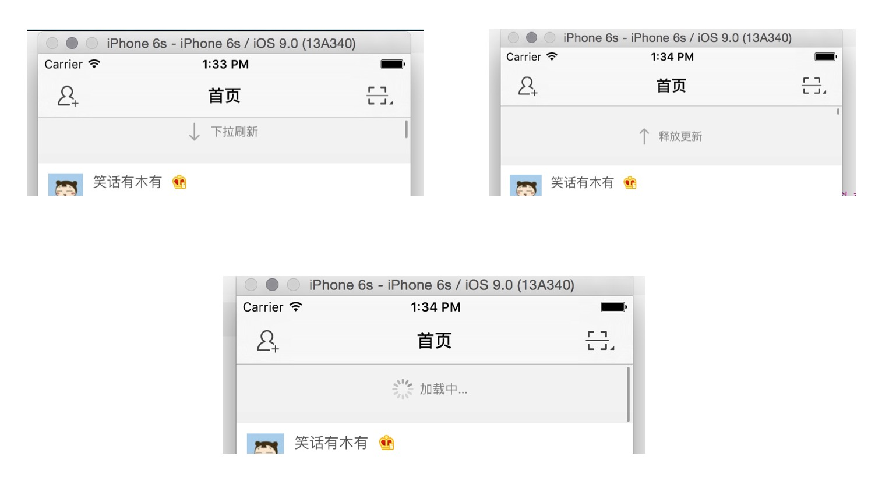

# 下拉刷新

## 实现效果

- 拖动 tableView，顶部显示 **下拉刷新**，箭头朝下
- 拖动到一定程度的时候，顶部显示 **释放更新**，箭头朝上
- 松手：
    - 到达一定程度松手，顶部显示 **加载中…**，隐藏箭头，显示菊花转
    - 未到达一定程度，直接回到最初状态

> 顶部的整个 View 会随着 tableView 的拖动而移动

### 示意图



## 实现思路
- 给 tableView 添加一个自定义刷新控件(`HMRefreshControl`)
- 这个刷新控件的 y 值是 **负**自己的高度，以让其放在 tableView 的顶部以及可以跟随 tableView 滑动
- 在刷新控件内部监听 tableView 的滑动
- 当滑动到某种程度去改变子控件要显示的逻辑
- 当用户松开手要刷新的时候，可以调整 tableView 的 `contentInset` 的 `top` 值以让刷新控件显示出来
- 在刷新的时候调用外部提供的方法执行刷新的逻辑

## 实现代码

- 自定义 `HMRefreshControl`

```swift
class HMRefreshView: UIControl {

    override init(frame: CGRect) {
        super.init(frame: frame)

        // 先设置默认宽度与高度
        self.width = SCREENW
        self.height = 44

        backgroundColor = RandomColor()
    }

    required init?(coder aDecoder: NSCoder) {
        fatalError("init(coder:) has not been implemented")
    }
}
```

- 定义懒加载控件 & 添加到首页的 tableView 中去

```
// 下拉刷新控件
private lazy var hmRefreshControl: HMRefreshControl = HMRefreshControl()

...

// 添加头部视图
tableView.addSubview(hmRefreshControl)
```

> 运行测试

- 定义 `scrollView` 属性

```swift
// 定义 scrollView，用于记录当前控件添加到哪一个 View 上的
var scrollView: UIScrollView?
```

- 在 `HMRefreshView` 中监听其添加到 `tableView` 的滚动

```swift
/// 当前 view 的父视图即将改变的时候会调用，可以在这个方法里面拿到父控件
override func willMoveToSuperview(newSuperview: UIView?) {
    super.willMoveToSuperview(newSuperview)
    // 如果父控件不为空，并且父控件是UIScrollView
    if let scrollView = newSuperview where scrollView.isKindOfClass(NSClassFromString("UIScrollView")!) {
        scrollView.addObserver(self, forKeyPath: "contentOffset", options: NSKeyValueObservingOptions.New, context: nil)
        // 记录当前 scrollView，以便在 `deinit` 方法里面移除监听
        self.scrollView = scrollView as? UIScrollView
    }
}

/// 当值改变之后回调的方法
override func observeValueForKeyPath(keyPath: String?, ofObject object: AnyObject?, change: [String : AnyObject]?, context: UnsafeMutablePointer<Void>) {
    printLog(change)
}

deinit{
    // 移除监听
    if let scrollView = self.scrollView {
        scrollView.removeObserver(self, forKeyPath: "contentOffset")
    }
}
```
> 注意：监听之后需要做两件事情：a.在合适的时候移除监听;b.一定要实现值改变之后的回调方法

- 根据滚动，计算出 refreshView 完全展示出现的临界点值

```swift
// 取到顶部增加的可滑动的距离
let contentInsetTop = self.scrollView!.contentInset.top
// 取到当前 scrollView 的偏移 Y
let contentOffsetY = self.scrollView!.contentOffset.y

// printLog("contentInsetTop=\(contentInsetTop);contentOffsetY=\(contentOffsetY)")

// 通过分析可知：contentOffsetY 如果小于 (-contentInsetTop - 当前 View 高度)，就代表当前 View 完全显示出来
// 而 (-contentInsetTop - 当前 View 高度) 这个值就代表临界值

// 临界值
let criticalValue = -contentInsetTop - self.height

// 在用户拖动的时候去判断临界值
if scrollView!.dragging {
    if contentOffsetY < criticalValue {
        printLog("完全显示出来啦")
    }else {
        printLog("没有完全显示出来/没有显示出来")
    }
}

```

- 根据以上状态添加 state 枚举

```swift
enum HMRefreshControlStatus: Int {
    case Normal = 0 // 默认状态
    case Pulling = 1 // 松手就可以刷新的状态
    case Refreshing = 2 // 正在刷新的状态
}
```
- 根据滑动的位置设置当前 View 的状态

```swift
// 在用户拖动的时候去判断临界值
if scrollView!.dragging {
    if contentOffsetY < criticalValue {
        printLog("完全显示出来啦")
        self.state = .Pulling
    }else {
        printLog("没有完全显示出来/没有显示出来")
        self.state = .Normal
    }
}
```

- 添加子控件 （箭头，提示文字label）

```swift
// MARK: - 懒加载控件
// 箭头图标
private lazy var arrowIcon: UIImageView = UIImageView(image: UIImage(named: "tableview_pull_refresh"))
// 显示文字的label
private lazy var messageLabel: UILabel = {
    let label = UILabel()
    label.text = "下拉刷新"
    label.textColor = UIColor.grayColor()
    label.font = UIFont.systemFontOfSize(12)
    return label
}()

...

// 添加子控件

private func setupUI(){
    backgroundColor = RandomColor()

    // 添加控件
    addSubview(arrowIcon)
    addSubview(messageLabel)

    // 添加约束
    arrowIcon.snp_makeConstraints { (make) -> Void in
        make.centerX.equalTo(self.snp_centerX).offset(-30)
        make.centerY.equalTo(self.snp_centerY)
    }
    messageLabel.snp_makeConstraints { (make) -> Void in
        make.leading.equalTo(arrowIcon.snp_trailing)
        make.centerY.equalTo(arrowIcon.snp_centerY)
    }
}
```

- 设置不同状态下执行不同的动画

```swift
// 定义当前控件的刷新状态
var state: HMRefreshControlStatus = .Normal {
    didSet{
        switch state {
        case .Pulling:
            UIView.animateWithDuration(0.25, animations: { () -> Void in
                self.arrowIcon.transform = CGAffineTransformMakeRotation(CGFloat(M_PI))
            })
            messageLabel.text = "释放更新"
        case .Normal:
            UIView.animateWithDuration(0.25, animations: { () -> Void in
                self.arrowIcon.transform = CGAffineTransformIdentity
            })
            messageLabel.text = "下拉刷新"
        default:
            break

        }
    }
}
```
> 运行测试

- 监听用户松手进入刷新状态，满足两个条件
    - 用户松手
    - 当前状态是 `Pulling` 状态 (可以进入刷新的状态)

```swift
// 在用户拖动的时候去判断临界值
    if scrollView!.dragging {
        if contentOffsetY < criticalValue {
            printLog("完全显示出来啦")
            self.state = .Pulling
        }else {
            printLog("没有完全显示出来/没有显示出来")
            self.state = .Normal
        }
    }else{
        // 判断如果用户已经松手，并且当前状态是.Pulling，那么进入到 .Refreshing 状态
        if self.state == .Pulling {
            printLog("进入刷新状态")
            self.state = .Refreshing
        }
    }
```

- 显示刷新状态的效果

```swift
// 1.懒加载控件
// 菊花转
private lazy var indecator: UIActivityIndicatorView = UIActivityIndicatorView(activityIndicatorStyle: UIActivityIndicatorViewStyle.Gray)

// 2.添加控件 & 设置约束

addSubview(indecator)
indecator.snp_makeConstraints { (make) -> Void in
    make.center.equalTo(arrowIcon.snp_center)
}


// 3.在 state 为 Refreshing 状态时显示效果
case .Refreshing:   // 显示刷新的效果
    // 添加顶部可以多滑动的距离
    UIView.animateWithDuration(0.25, animations: { () -> Void in
        var contentInset = self.scrollView!.contentInset
        contentInset.top += self.height
        self.scrollView?.contentInset = contentInset
    })

    // 隐藏箭头
    arrowIcon.hidden = true
    // 开始菊花转
    indecator.startAnimating()
    // 显示 `加载中…`
    messageLabel.text = "加载中…"
```

- 在`默认状态`下显示箭头，隐藏菊花转

```swift
case .Normal:       // 置为默认的状态的效果
    UIView.animateWithDuration(0.25, animations: { () -> Void in
        self.arrowIcon.transform = CGAffineTransformIdentity
    })
    messageLabel.text = "下拉刷新"
    arrowIcon.hidden = false
    indecator.stopAnimating()
```


> 运行：测试发现当松手刷新的时候，显示的效果能出来，但是当一滑动的时候状态就发会了改变，而 `Refreshing` 的状态改变是由数据刷新完成之后去重置，所以更改滑动时候的判断逻辑

- 更改滑动时的判断逻辑，以防止`正在刷新中`的时候的状态异常改变

```swift
// 在用户拖动的时候去判断临界值
if scrollView!.dragging {
    if state == .Normal && contentOffsetY < criticalValue {
        printLog("完全显示出来啦")
        self.state = .Pulling
    }else if state == .Pulling && contentOffsetY >= criticalValue {
        printLog("没有完全显示出来/没有显示出来")
        self.state = .Normal
    }
}else{
    // 判断如果用户已经松手，并且当前状态是.Pulling，那么进入到 .Refreshing 状态
    if self.state == .Pulling {
        self.state = .Refreshing
    }
}
```

- 模拟 5 秒后结束刷新

```swift
UIView.animateWithDuration(0.25, animations: { () -> Void in
        var contentInset = self.scrollView!.contentInset
        contentInset.top += self.height
        self.scrollView?.contentInset = contentInset
    }, completion: { (finish) -> Void in

        // 模似 5 秒之后约束刷新
        dispatch_after(dispatch_time(DISPATCH_TIME_NOW, Int64(5 * Double(NSEC_PER_SEC))), dispatch_get_main_queue()) { () -> Void in
            // 设置状态为 默认状态
            self.state = .Normal
            // 重置contentInsetTop
            UIView.animateWithDuration(0.25, animations: { () -> Void in
                var contentInset = self.scrollView!.contentInset
                contentInset.top -= self.height
                self.scrollView?.contentInset = contentInset
            })
        }
    })
```

> 运行测试

- 定义属性

```swfit
// 执行的对象
var target: AnyObject?
// 要执行的方法
var action: Selector?
```
- 添加要执行刷新的方法

```swift
hmRefreshControl.addTarget(self, action: "loadData", forControlEvents: UIControlEvents.ValueChanged)
```

- 在刷新的时候执行方法

```swift
case .Refreshing:   // 显示刷新的效果
    ...
    // 调用刷新的方法
    sendActionsForControlEvents(.ValueChanged)
```
- 去掉上面模拟5秒结束刷新的逻辑，添加结束刷新方法

```swift
func endRefreshing(){
    // 重置contentInsetTop
    UIView.animateWithDuration(0.25, animations: { () -> Void in
        var contentInset = self.scrollView!.contentInset
        contentInset.top -= self.height
        self.scrollView?.contentInset = contentInset
    })
    // 设置状态为 默认状态
    self.state = .Normal
}
```

- 在刷新完毕之后调用 `HMRefreshView` 的 `endRefreshing()` 方法

```swift
/// 结束刷新
private func endRefresh(){
    pullupView.stopAnimating()
    refreshView.endRefreshing()
}
```

> 运行测试：第一次启动的时候，刷新完毕，出现contentInset.top值递减问题，所以要判断如果之前状态是刷新状态，结束刷新才去更改contentInset.top

- 增加保存上一次状态的逻辑

```swift

// 定义旧状态属性，保存上一次状态
var oldState: HMRefreshState?

// 在 `state` 的 `didSet` 方法末尾记录状态
// 定义当前控件的刷新状态
var state: HMRefreshState = .Normal {
    didSet{
        switch state {
        case .Pulling:      // 松手就可以刷新的状态
            ...
        case .Normal:       // 置为默认的状态的效果
            ...
        case .Refreshing:   // 显示刷新的效果
            ...
        }
        // 记录本次状态
        oldState = state
    }
}
```

- 在结束刷新的时候判断如果是从`刷新状态`进入到`默认状态`就递减contentInset.top

```swift
/// 结束刷新
func endRefreshing(){
    if oldState == .Refreshing {
        // 重置contentInsetTop
        UIView.animateWithDuration(0.25, animations: { () -> Void in
            var contentInset = self.scrollView!.contentInset
            contentInset.top -= self.height
            self.scrollView?.contentInset = contentInset
        })
    }
    // 设置状态为 默认状态
    self.state = .Normal
}
```

- 部分代码抽取

```swift
// 把结束刷新的逻辑，移动到 state 的 didSet 的 case .Normal 中
switch state {
    case .Pulling:      // 松手就可以刷新的状态
        ...
    case .Normal:       // 置为默认的状态的效果
        ...
        // 如果之前状态是刷新状态，需要递减 contentInset.top
        if oldState == .Refreshing {
            // 重置contentInsetTop
            UIView.animateWithDuration(0.25, animations: { () -> Void in
                var contentInset = self.scrollView!.contentInset
                contentInset.top -= self.height
                self.scrollView?.contentInset = contentInset
            })
        }
    case .Refreshing:   // 显示刷新的效果
        ...
    }
...

// 抽取之后的方法
func endRefreshing(){
    // 设置状态为 默认状态
    self.state = .Normal
}

```
> 运行测试


