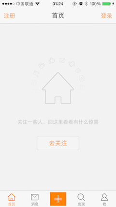
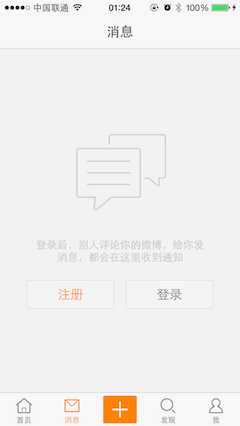
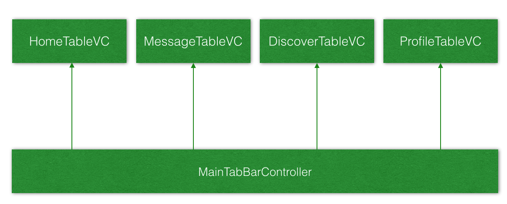
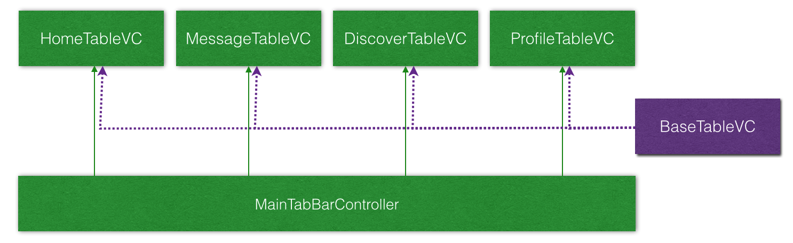

# 访客视图 - 目标

* 如果用户没有登录，显示`访客视图`，提示用户注册或者登录

## 课程重点

1. 自定义 `TableViewController` 的基类 `VisitorViewController`
2. 自定义访客视图，用代码实现苹果原生的自动布局
3. 设置全局外观

## 应用实例

* 在实际应用开发中，有可能会出现：
    * 功能框架已经构建完成
    * 产品经理提出新的功能需求
    * 而新提出的功能需求，会对已有的架构产生影响
    * 例如，在新浪微博中，已经搭建好程序架构，但是如何应对用户登录的处理呢？

## 新的需求 —— 未登录页面

### 界面截图

* 首页

* 消息

* 发现

* 我

## 架构分析及调整

* 现有架构图

* 新增 `HMVisitorViewController`

