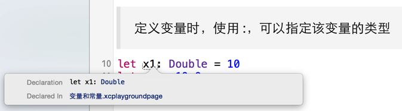

# 变量和常量

## 定义

* `let` 定义常量，一经赋值不允许再修改
* `var` 定义变量，赋值之后仍然可以修改

```swift
//: # 常量
//: 定义常量并且直接设置数值
let x = 20
//: 常量数值一经设置，不能修改，以下代码会报错
// x = 30

//: 使用 `: 类型`，仅仅只定义类型，而没有设置数值
let x1: Int
//: 常量有一次设置数值的机会，以下代码没有问题，因为 x1 还没有被设置数值
x1 = 30
//: 一旦设置了数值之后，则不能再次修改，以下代码会报错，因为 x1 已经被设置了数值
// x1 = 50

//: # 变量
//: 变量设置数值之后，可以继续修改数值
var y = 200
y = 300
```

## 自动推导

* Swift能够根据右边的代码，推导出变量的准确类型
* 通常在开发时，不需要指定变量的类型
* 如果要指定变量，可以在变量名后使用:，然后跟上变量的类型

> 重要技巧：Option + Click 可以查看变量的类型



## 没有隐式转换！！！

* Swift 对数据类型要求异常严格
* 任何时候，都不会做隐式转换

> 如果要对不同类型的数据进行计算，必须要显式的转换

```swift
let x2 = 100
let y2 = 10.5

let num1 = Double(x2) + y2
let num2 = x2 + Int(y2)
```

## let & var 的选择

* **应该尽量先选择常量**，只有在必须修改时，才需要修改为 `var`
* 在 Xcode 7.0 中，如果没有修改变量，Xcode 会提示修改为 `let`

