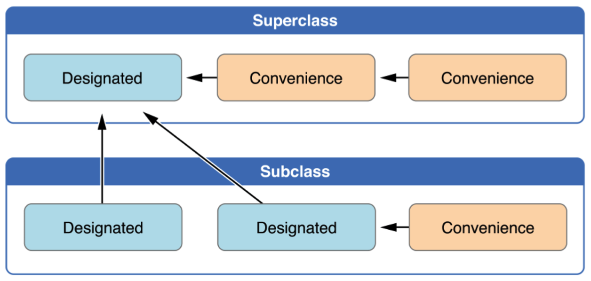

# convenience 便利构造函数

* 默认情况下，所有的构造方法都是指定构造函数 `Designated`
* `convenience` 关键字修饰的构造方法就是便利构造函数
* 便利构造函数具有以下特点：
    * 可以返回 `nil`
    * 只有便利构造函数中可以调用 `self.init()`
    * 便利构造函数不能被`重写`或者 `super`


```swift
/// `便利构造函数`
///
/// - parameter name: 姓名
/// - parameter age:  年龄
///
/// - returns: Person 对象，如果年龄过小或者过大，返回 nil
convenience init?(name: String, age: Int) {
    if age < 20 || age > 100 {
        return nil
    }

    self.init(dict: ["name": name, "age": age])
}
```

> 注意：在 Xcode 中，输入 `self.init` 时没有智能提示


```swift
/// 学生类
class Student: Person {

    /// 学号
    var no: String?

    convenience init?(name: String, age: Int, no: String) {
        self.init(name: name, age: age)

        self.no = no
    }
}
```

## 便利构造函数应用场景

* 根据给定参数判断是否创建对象，而不像指定构造函数那样必须要实例化一个对象出来
* 在实际开发中，可以对已有类的构造函数进行扩展，利用便利构造函数，简化对象的创建


## 构造函数小结

* 指定构造函数必须调用其直接父类的的指定构造函数（除非没有父类）
* 便利构造函数必须调用同一类中定义的其他`指定构造函数`或者用 `self.` 的方式调用`父类的便利构造函数`
* 便利构造函数可以返回 `nil`
* 便利构造函数不能被重写


