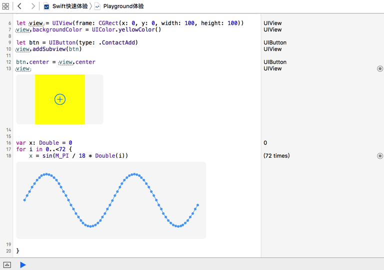

# Playground



* Playground 是 Xcde 6 推出的新功能
* 创建工程编写和运行程序，目的是为了编译和发布程序
* 而使用 Playground 的目的是为了：
    * 学习代码
    * 实验代码
    * 测试代码
* 并且能够可视化地看到运行结果
* 另外，使用 Playground 只需要一个文件，而不需要创建一个复杂的工程

## 快速体验

```swift
let btn = UIButton(type: UIButtonType.ContactAdd)

let view = UIView(frame: CGRect(x: 0, y: 0, width: 100, height: 100))
view.backgroundColor = UIColor.lightGrayColor()

btn.center = view.center
view.addSubview(btn)

print(view)
print(view.subviews)
```

## 提示

* 官方提供的一些学习资源是以 `playground` 的形式提供的
* 建立一个属于自己的 `playgound` 文件，能够在每次版本升级时，第一时间发现语法的变化
