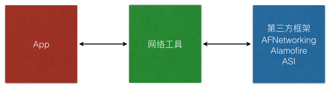

# AFNetworking

## 准备工作

* 修改 `Podfile`，修改后的内容如下

```
platform :ios, '8.0'
pod 'ReactiveCocoa'
pod 'AFNetworking'
```

* 在终端输入以下命令

```bash
$ pod update
```

* `info.plist`

```
NSAppTransportSecurity
NSAllowsArbitraryLoads
```

## 封装网络框架

* 在应用程序开发中，一定要封装隔离网络框架
* 示意图如下：




* 新建网络工具类 `NetworkTools`
* 实现单例

```objc
+ (instancetype)sharedTools {

    static NetworkTools *instance;

    static dispatch_once_t onceToken;
    dispatch_once(&onceToken, ^{
        instance = [[NetworkTools alloc] initWithBaseURL:nil];

        instance.responseSerializer.acceptableContentTypes = [NSSet setWithObjects:@"application/json", @"text/json", @"text/javascript", @"text/html", nil];
    });

    return instance;
}
```

* 建立网络请求方法

```objc
- (void)request:(NSString *)urlString params:(NSDictionary *)params {
    [self GET:urlString parameters:params success:^(NSURLSessionDataTask * _Nonnull task, id  _Nonnull responseObject) {

        NSLog(@"%@", responseObject);
    } failure:^(NSURLSessionDataTask * _Nonnull task, NSError * _Nonnull error) {
        NSLog(@"%@", error);
    }];
}
```

* 测试网络请求

```objc
[[NetworkTools sharedTools] request:@"http://www.weather.com.cn/data/sk/101010100.html" params:nil];
```

* 增加网络请求`信号`

```swift
- (RACSignal *)request:(NSString *)urlString params:(NSDictionary *)params {
    return [RACSignal createSignal:^RACDisposable *(id<RACSubscriber> subscriber) {
        [self GET:urlString parameters:params success:^(NSURLSessionDataTask * _Nonnull task, id  _Nonnull responseObject) {
            [subscriber sendNext:responseObject];
            [subscriber sendCompleted];
        } failure:^(NSURLSessionDataTask * _Nonnull task, NSError * _Nonnull error) {
            [subscriber sendError:error];
        }];

        return nil;
    }];
}
```

* 测试信号响应

```swift
[[[NetworkTools sharedTools] request:@"http://www.weather.com.cn/data/sk/101010100.html" params:nil] subscribeNext:^(id x) {
    NSLog(@"%@", x);
} error:^(NSError *error) {
    NSLog(@"%@", error);
}];
```


