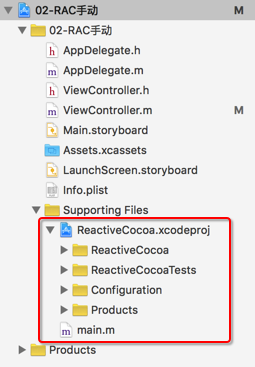
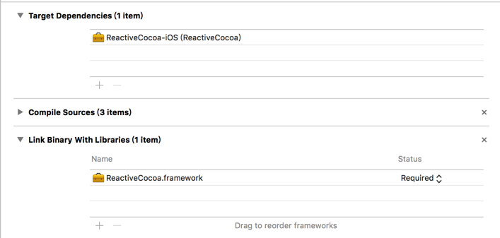
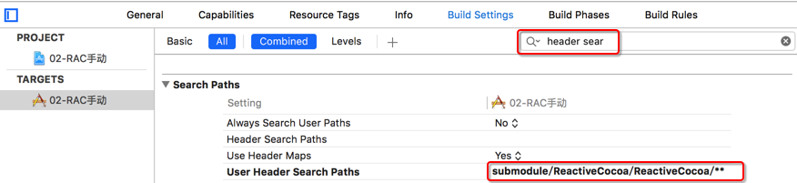
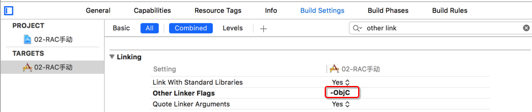

# 手动安装 - Submodule

* 新建 Xcode 项目
    * 创建项目时，一定要勾选 `Git`
* 进入终端，输入以下命令

```bash
# 切换至项目目录
$ cd 项目目录

# 以子模块(submodule)的方式添加 ReactiveCocoa
$ git submodule add https://github.com/ReactiveCocoa/ReactiveCocoa.git submodule/ReactiveCocoa

# 递归更新 ReactiveCocoa 的依赖库
$ git submodule update --init --recursive
```

* 会到 Xcode 项目
* 将 `/submodule/ReactiveCocoa/ReactiveCocoa.xcodeproj` 项目拖拽到项目中，如下图所示



* 设置项目依赖，如下图所示：



* 设置头文件搜索路径为：`/submodule/ReactiveCocoa/ReactiveCocoa`



* 设置Other Linker Flags



* 提示：如果导入的框架中有分类，在添加框架时，一定要设置 `-ObjC`，注意大小写


> 千万要注意：如果用 XCode 7，再次打开项目时，千万不要升级项目
