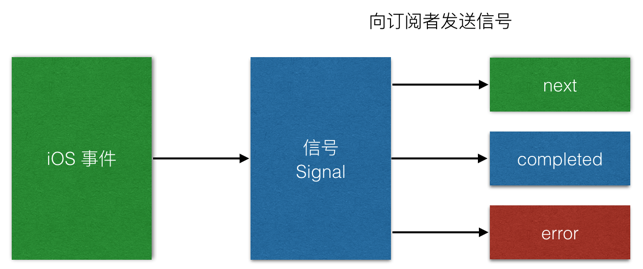

# Reactive Cocoa

* `Reactive Cocoa` 是 iOS 开发的一个`重量级`框架
* 高大上的概念：响应式编程
* 核心概念：`信号 Signal`

官方网站：https://github.com/ReactiveCocoa/ReactiveCocoa

## 概念

### 响应式编程

* 举个栗子，在一般程序开发时

```
a = b + c
```

赋值之后 `b` 或者 `c` 的值变化后，`a` 的值不会跟着变化

如果使用`响应式编程`，目标就是，如果 `b` 或者 `c` 的数值发生变化，`a` 的数值会同时发生变化

> 思考？如何才能做到及时响应呢？

对 `b` 和 `c` 进行观察，一旦发生变化，及时通知 `a` 发生变化

### RAC 的核心思想

* 所谓`响应`，就是 `事件` 发生后做出`响应`
* iOS 开发中的事件包括：
    * Target
    * Delegate
    * KVO
    * 通知
    * 时钟
    * 网络异步回调

* 而 `ReactiveCocoa` ，就是用 `信号` 接管了 iOS 中的所有事件



### RAC 小结

* 超重量级的核心框架，学习成本较高
* 利用`信号`，接管 iOS 的所有事件
* 利用 Block 的方式将所有相关代码集中在一起，从一定程度上解决了代码分散的问题
* 使用时需要注意循环引用，注册 `rac_willDeallocSignal` 信号能够跟踪对象是否被释放
* 通过 KVO 监听，能够及时将模型数据变化体现在界面上
